# SQL 🚀

> ### Database
> - 관게형 데이터베이스 : 테이블, 행, 열의 정보를 구조화하는 방식, 서로 관련된 데이터 포인터를 저장하고 이에 대한 엑세스를 제공
> 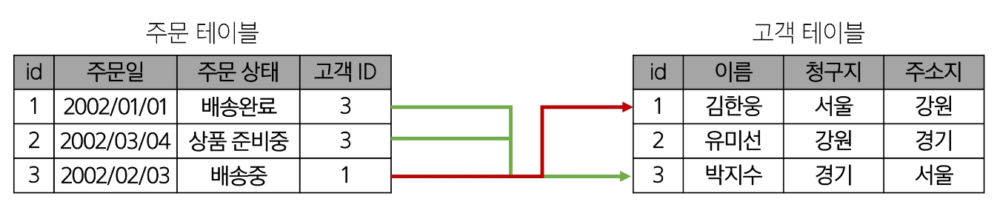
>> 예시
>> - 고객 데이터 간 비교를 위해서는 어떤 값을 활용해야 할까? 
>> - 기본 키(데이터에 고유한 식별 값을 부여), 외래 키(주문 정보에 고객의 고유한 식별 값을 저장하기)
>> 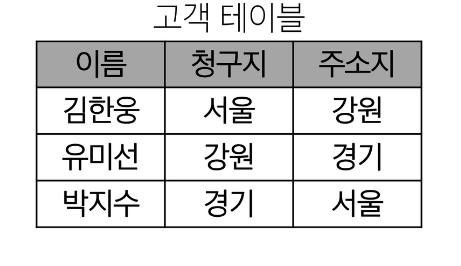
>> 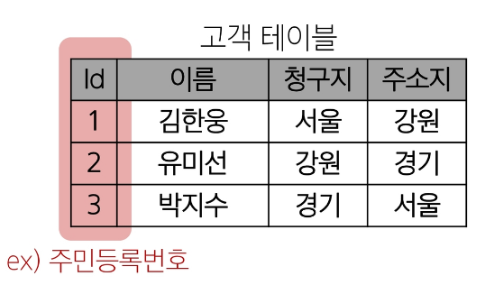
>> 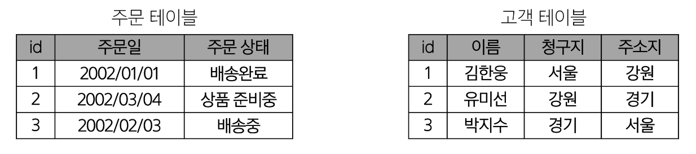
>> 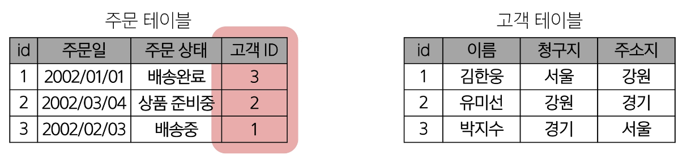

> #### Keyword
> 1. Table(Relation) : 데이터를 기록하는 곳
> 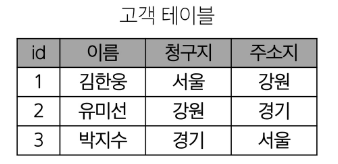
> 2. Field(Column, Attribute) : 고유의 타입이 지정됨
> 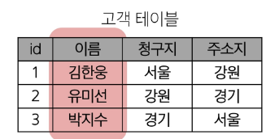
> 3. Record(Row, Tuple) : 구체적인 데이터 값이 저장됨
> 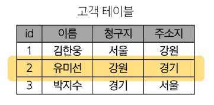
> 4. Database(Schema) : 테이블의 집합
> 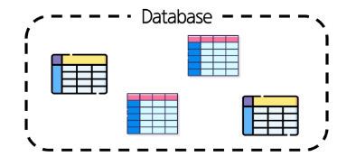
> 5. Primary Key(PK) : 각 레코드의 고유한 값, 레코드의 식별자로 활용
> 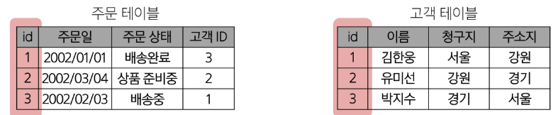
> 6. Foreign Key(FK) : 각 레코드에서 서로 다른 테이블 간의 관계를 만드는 데 사용
> 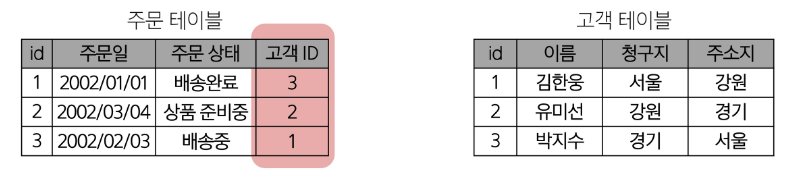

> ### DBMS (Database Managements System)
> - 데이터베이스를 관리하는 소프트웨어 프로그램
> - 데이터 저장 및 관리를 용이하게 하는 시스템
> - 데이터베이스와 사용자 간의 인터페이스 역할
> - 사용자가 데이터 구성, 업데이트, 모니터링, 백업, 복구 등을 할 수 있도록 도움
> - ex) SQLite, MySQL, PostgreSQL, Oracle Database

> ### 정리
> - Table은 데이터가 기록되는 곳
> - Table에는 행에서 고유하게 식별 가능한 기본 키라는 속성이 존재, 외래 키를 사용하여 각 행에서 서로 다은 테이블 간의 관계를 만들 수 있음
> - 데이터는 기본 키 또는 외래 키를 통해 결합(join) 될 수 있는 여러 테이블에 걸쳐 구조화 됨

> ### SQL(Structure Query Language)
> 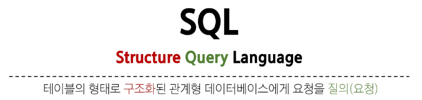
> 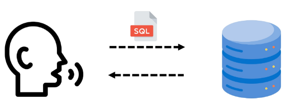
> - 데이터베이스에 정보를 저장하고 처리하기 위한 프로그래밍 언어

> #### SQL Statements 예시
> 
> - 이 Statement는 SELECT, FROM 2개의 keyword 로 구성 됨
>> - DDL : 데이터 정의
>> - DQL : 데이터 검색
>> - DML : 데이터 조작
>> - DCL : 데이터 제어
>> 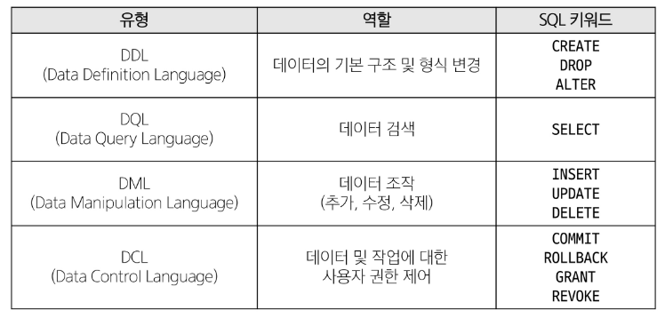

> ### DQL(Data Query Language)
> #### 01. Querying data
> - ***select***
>> 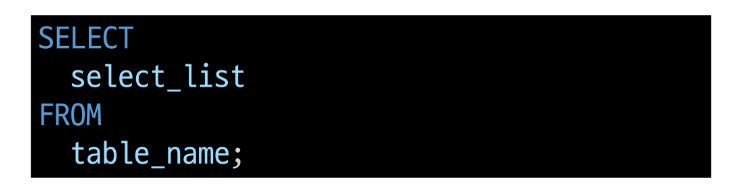
>> - select 키워드 이후 데이터를 선택하려는 필드를 하나 이상 지정
>> - from 키워드 이후 데이터를 선택하려는 테이블의 이름을 지정

> #### 02. Sorting data
> - ***order by***
>> 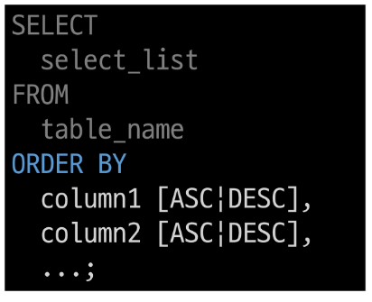
>> - from clause 뒤에 위치
>> - 하나 이상의 컬럼을 기준으로 결과를 오름차순(ASC, default), 내림차순(DESC) 정렬
>> 
>> - 1. 테이블에서(from) 
>> - 2. 조회하여 (select)
>> - 3. 정렬 (order by)

> #### 03. Filtering data
>> 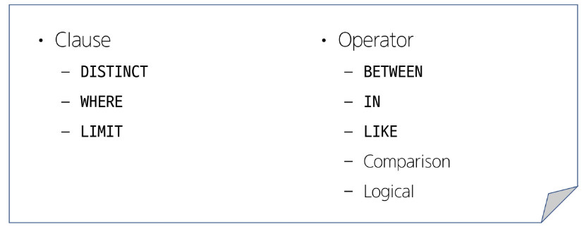

> - ***distinct*** : 조회 결과에서 중복된 레코드를 제거
>> 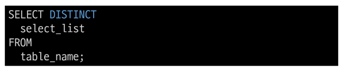
>> - select 키워드 바로 뒤에 작성
>> - select distinct 키워드 다음에 고유한 값을 선택하려는 하나 이상의 필드를 지정
> - ***where*** : 조회 시 특정 검색 조건을 지정
>> 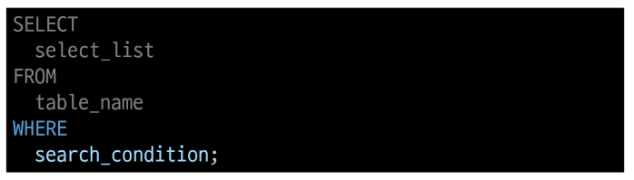
>> - from clause 뒤에 위치
>> - search_condition은 비교연산자 및 논리연산자(and, or, not 등)를 사용하는 구문이 사용됨
> - ***Comparison Operators***
>   - 비교 연산자 [=, >=, <= , != , IS, LIKE, IN, BETWEEN...AND]
> - ***Logical Operators***
>   - 논리 연산자 [AND(&&), OR(||), NOT(!)]
> - ***In Operator***
>   - 값이 특정 목록 안에 있는지 확인
> - ***LIKE Operator***
>   - 값이 특정 패턴에 일치하는지 확인
>   - % : 0개 이상의 문자열과 일치 하는지 확인
>   - _ : 단일 문자와 일치하는지 확인

> - ***LIMIT clause***
> 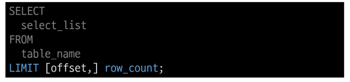
> 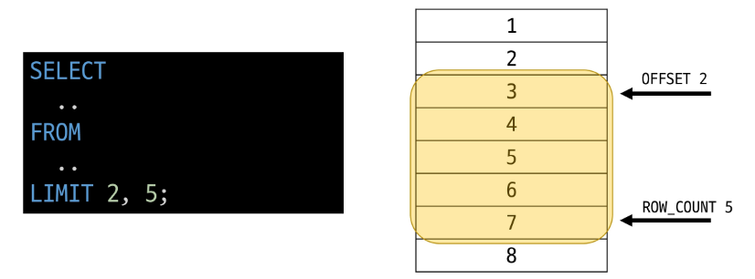
> - 하나 또는 두 개의 인자를 사용(0 또는 양의 정수), row_count는 조회하는 최대 레코드 수를 지정

> #### 04. Grouping data
> - 레코드를 그룹화하여 요약본 생성('집계 합수'와 함께 사용)
> - Aggregation Functions
>   - 값에 대한 계산을 수행하고 단일한 값을 반환하는 함수 
>   - SUM, AVG, MAX, MIN, COUNT
> 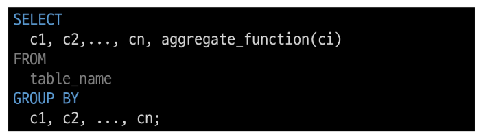
> - FROM 및 WHERE 절 뒤에 배치
> - GROUP BY 절 뒤에 그룹화 할 필드 목록을 작성
> 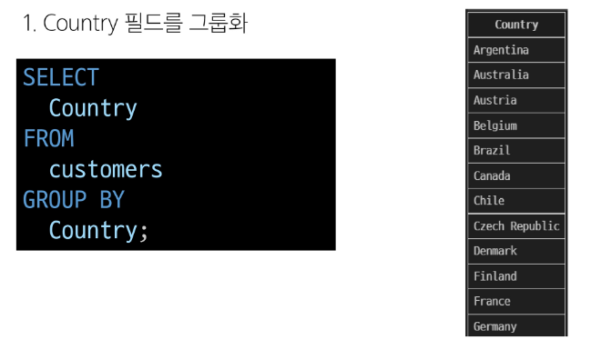
> 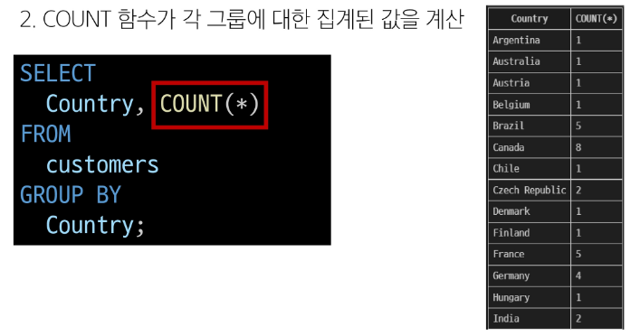

> 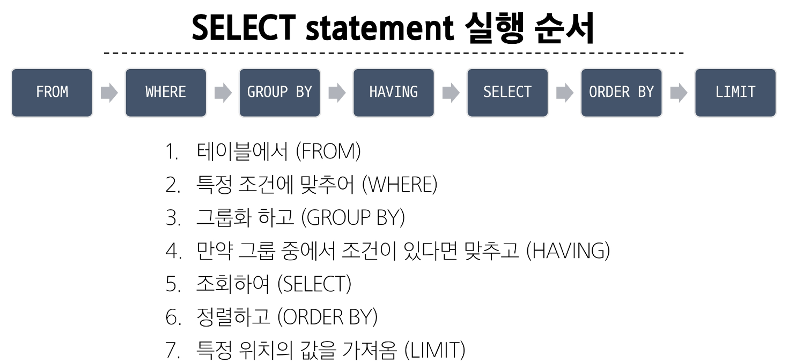