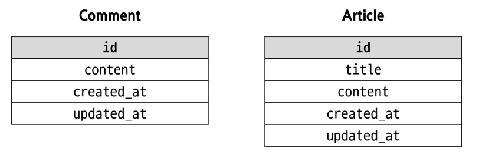
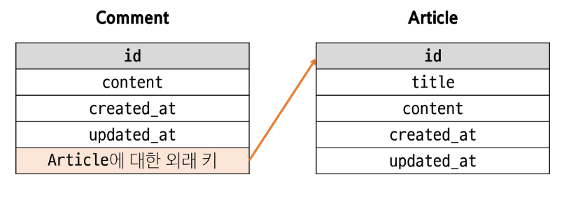
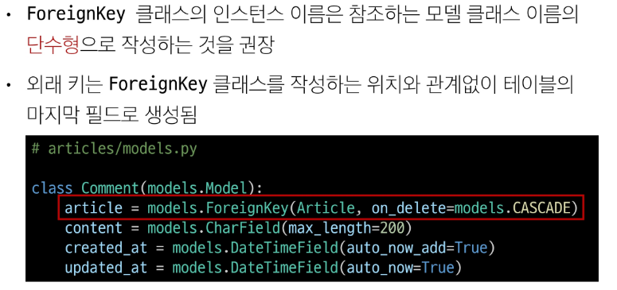
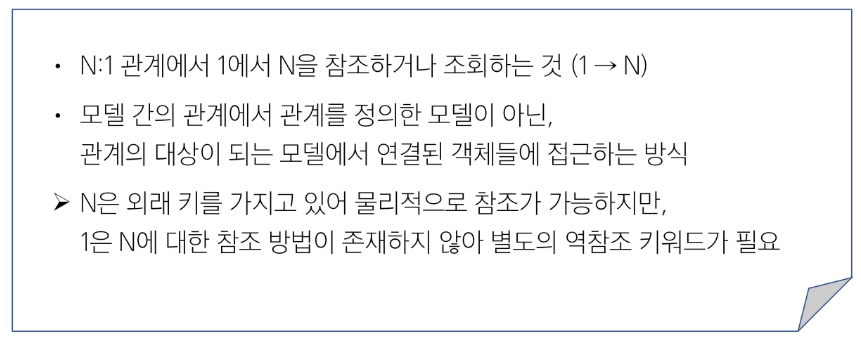
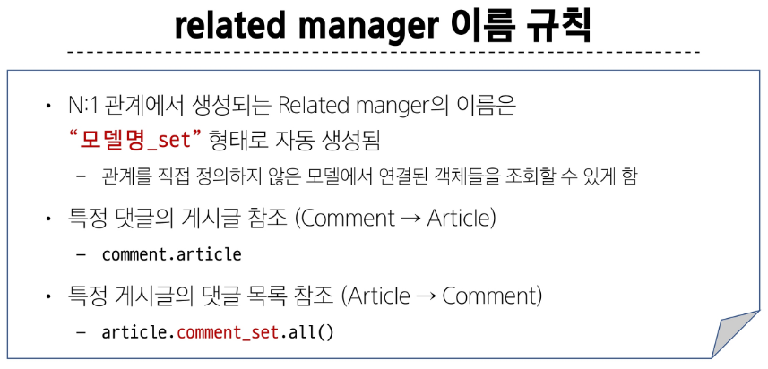

# Many to one relationships 01 🚀

> ### Many to one relationships N : 1 or 1 : N
> 
> 
> - 한 테이블의 0개 이상의 레코드가 다른 테이블의 레코드 한 개와 관련된 관계

> ### ForeignKey()
> 
> 
> 
> - 한 모델이 다른 모델을 참조하는 관계를 설정하는 필드
> - N : 1 관계 표현, 데이터베이스에서 외래 키로 구현

> ### 관계 모델 참조
> #### 역참조
> 
> 
> 
> 