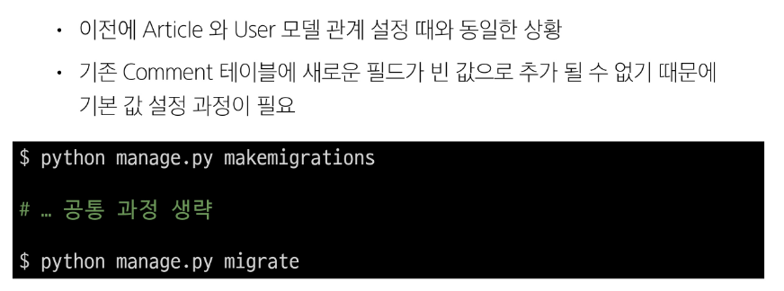

# Many to one relationships 02 🚀

> ### Article & User
> 
> 

> #### Migration
> 
> 
> 
> 

> ### 게시글 CREATE
> 
> 
> 
> 
> 

> ### 게시글 READ
> 
> 

> ### 게시글 UPDATE
> 
> 

> ### 게시글 DELETE
> 

> ### Comment - User 모델 관계 설정
> 
> #### Migration
> 
> 

> ### 댓글 CREATE
> 
> 
> 
> 

> ### 댓글 READ
> 
> 

> ### View decorators
> 
> #### Allowed HTTP methods
> 
> 
> 
> 
> 
> 
> 

> ### ERD (Entity-Relationship Diagram)
> 
> 
> 
> 
> 
> 
> 
> 