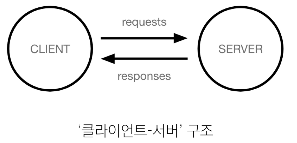
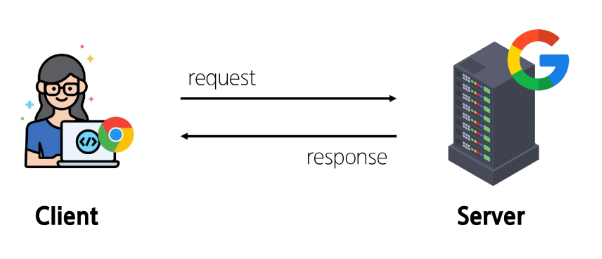
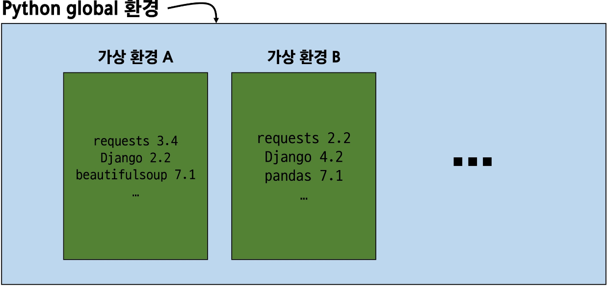
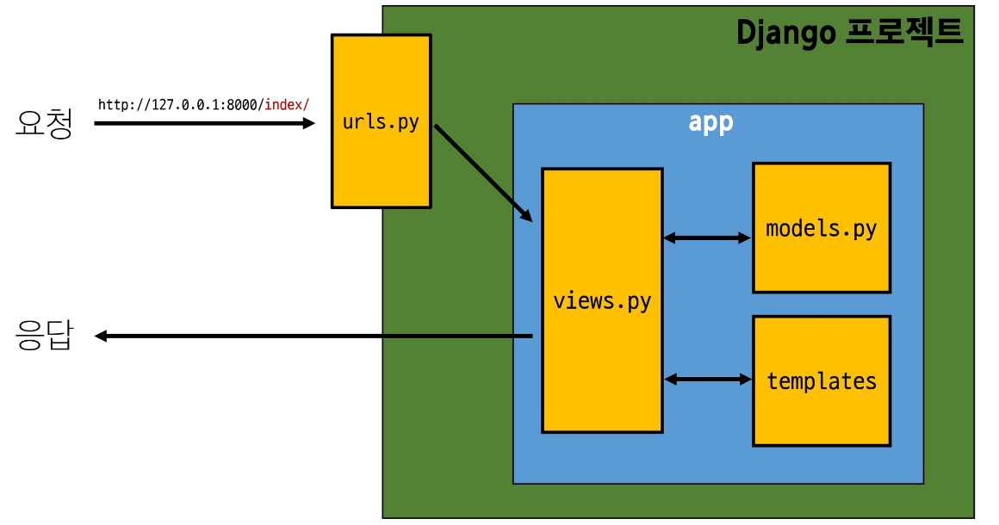

# Web Application 💻

> ### 개념
>> - 인터넷을 통해 사용자에게 제공되는 소프트웨어 프로그램을 구축하는 과정
>> - 다양한 디바이스(모바일, 태블릿, PC 등)에서 웹 브라우저를 통해 접근하고 사용할 수 있음

> ### 클라이언트 - 서버
>
>> - Client, 서비스를 요청하는 주체(웹 사용자의 인터넷이 연결된 장치, 웹 브라우저)
>> - Server, 클라이언트의 요청에 응답하는 주체(웹 페이지, 앱을 저장하는 컴퓨터)

> ### 웹 페이지를 보게 되는 과정
> 
>> - 1. 웹 브라우저(클라이언트)에서 'google.com'을 입력
>> - 2. 웹 브라우저는 인터넷에 연결된 전세계 어딘 가에 있는 구글 컴퓨터(서버)에게 '메인 홈페이지.html' 파일을 달라고 요청
>> - 3. 요청을 받은 구글 컴퓨터는 데이터베이스에서 '메인 홈페이지.html' 파일을 찾아 응답
>> - 4. 웹 브라우저는 전달받은 '메인 홈페이지.html' 파일을 사람이 볼 수 있도록 해석해주고 사용자는 구글의 메인 페이지를 보게 됨

> ### Frontend & Backend
> 
>> - Frontend : 사용자 인터페이스(UI)를 구성하고, 사용자가 애플리케이션과 상호작용할 수 있도록 함
>>      - HTML, CSS, JAVASCRIPT, 프론트엔트 프레임워크
>> - Backend : 서버 측에서 동작하며, 클라이언트의 요청에 대한 처리와 데이터베이스와의 상호작용 등을 담당
>>      - 서버언어 및 백엔드 프레임워크, 데이터베이스, API, 보안 등

> ###  Web Framework
>> - 웹 애플리케이션을 빠르게 개발할 수 있도록 도와주는 도구(개발에 필요한 기본 구조, 규칙, 라이브러리 등을 제공)

> ### 가상환경
> 
> 
> 
>> - 애플리케이션과 그에 따른 패키지들을 격리하여 관리할 수 있는 ***독립적인*** 실행환경

> ### 가상환경 생성
>> - venv 라는 이름의 가상환경 생성
>> - 임의 이름으로 생성이 가능하나 관례적으로 venv 이름을 사용
>>      -  ***$ python -m venv venv***
>> - 가상환경 활성화(on/off)
>> - 활성화 명령어가 OS에 따라 다름에 주의
>>      - ***$ source venv/Scripts/activate***
>>      - mac / Linux : ***$ source venv/bin/activate***
>> - 환경에 설치된 패키지 목록 확인
>>      - ***$ pip list***
>> - 설치된 패키지 목록 생성
>> - 현재 Python 환경에 설치된 모든 패키지와 그 버전을 텍스트 파일로 저장
>> - requirements.txt: 생성될 파일 이름(관례적으로 사용)
>>      - ***$ pip freeze > requirements.txt***
>> - 번외로 패키지 목록 기반 설치(다른 환경에서 동일한 환경 구성)
>>      - ***$ pip install -r requirements.txt***
>> - 가상환경 비활성화
>>      - ***$ deactivate***

> ### 패키지 목록이 필요한 이유
> 

> ### 의존성 패키지
>> - 한 소프트웨어 패키지가 다른 패키지의 기능이나 코드를 사용하기 때문에 그 패키지가 존재해야만 제대로 작동하는 관계
>> - 사용하려는 패키지가 설치되지 않았거나, 호환되는 버전이 아니면 오류가 발생하거나 예상치 못한 동작을 보일 수 있음.

> ### 패키지 목록 파일 특징 및 주의 사항
> 
>> - 가상환경의 패키지 목록을 쉽게 공유 가능
>> - 프로젝트의 의존성을 명확히 문서화
>> - 동일한 개발 환경을 다른 시스템에서 재현 가능
>> - [주의] 활성화된 가상환경에서 실행해야 정확한 패키지 목록 생성, 시스템 전역 패키지와 구분 필요

> ### 디자인 패턴
>> - 소프트웨어 설계에서 발생하는 문제를 해결하기 위한 일반적인 해결책(공통적인 문제를 해결하는 데 쓰이는 형식화 된 관행)
>> - 1. ***MVC 디자인 패턴(Model, View, Controller)***
>   - 데이터 & 사용자 인터페이스 & 비즈니스 로직을 분리
>> - 2. ***MTV 디자인 패턴(Model, Template, View)***
>   - Django에서 애플리케이션을 구조화하는 패턴

> ### Django 응답 & 요청
> 