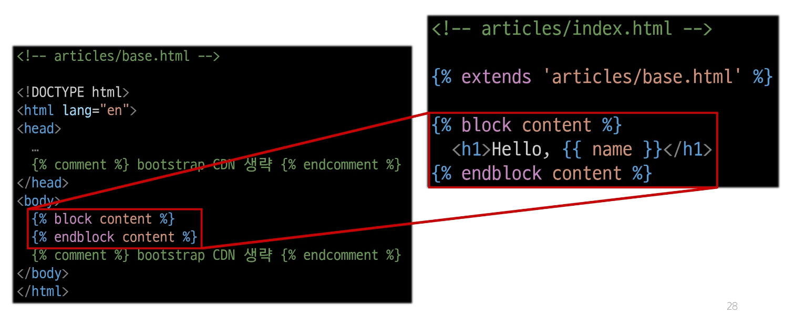
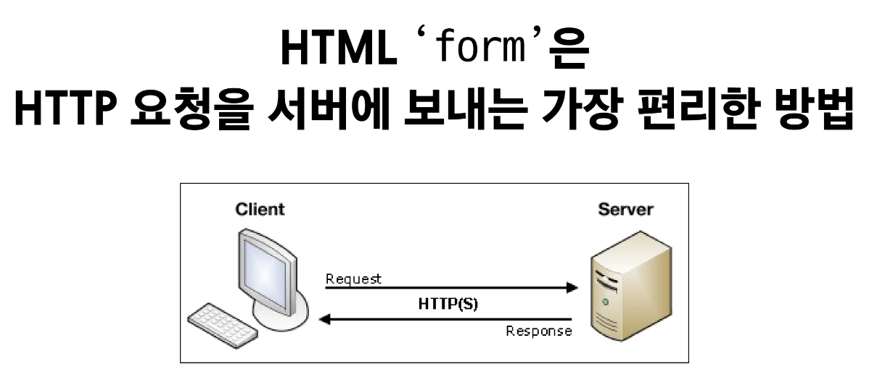
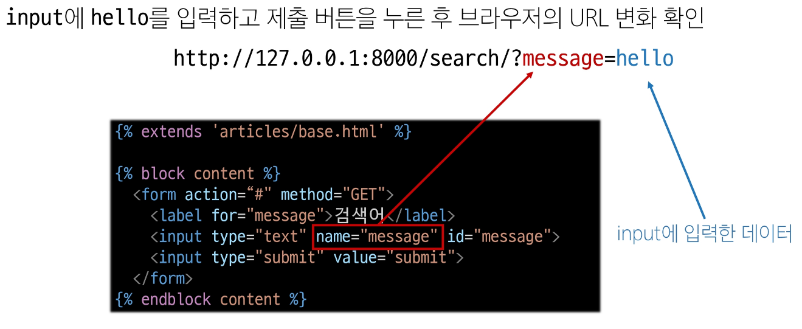
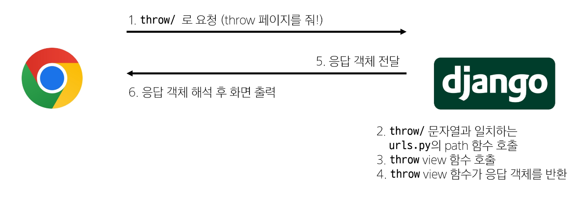
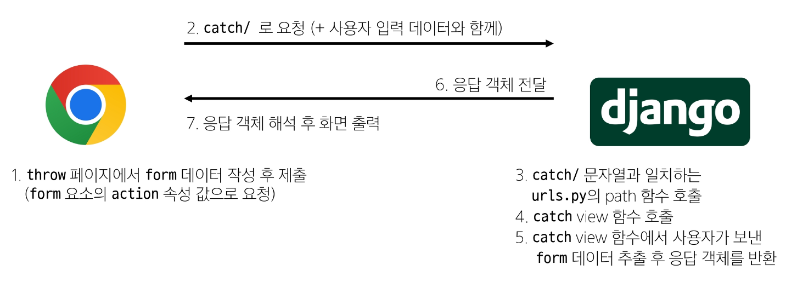

# Django Template Language 💻

> ### Variable
>> - render 함수의 세번째 인자로 딕셔너리 데이터를 사용
>> - dot을 사용하여 변수 속성에 접근 할 수 있음
>> - ex) {{variable.attribute}}

> ### Filters
>> - 표시할 변수를 수정할 때 사용 (변수 + '|' + 필터)
>> - ex) {{name|truncatewords:30}}

> ### Tags
>> - 반복 또는 논리를 수행하여 제어 흐름을 만듦
>> - 일부 태그는 시작과 종료 태그가 필요
>> - ex) , , 

> ### Comments
>> - ex) {# name #}, 

> ## 템플릿 상속
> - 페이지의 공통 요소를 포함하고, 하위 템플릿이 재정의 할 수 있는 공간을 정의하는 기본 'skeleton' 템플릿을 작성하여 상속 구조를 구축
> - nav bar , footer 등 공통적인 요소를 베이스에 넣고, 재작성 해야하는 부분만 만들어 주기
>> - 
>> - 'extends' tag : 자식 템플릿 최상단에 작성되어야 함(2개 이상 사용 불가)  
>> - 'block' tag : 상위 템플릿에 작성하며 하위 템플릿이 작성 할 수 있는 공간을 지정    

> ## 요청과 응답
> - 
> - 
>> - action : 입력 데이터가 전송될 url 을 지정, 속성을 지정하지 않으면 데이터는 현재 form이 있는 페이지의 url로 보내짐
>> - method : 데이터를 어떤 방식으로 보낼 것인지 정의, HTTP request methods(GET, POST)지정
>> - HTTP request 객체 : form으로 전송한 데이터 뿐만 아니라 Django로 들어오는 모든 요청 관련 데이터가 담겨 있음(view 함수의 첫번째 인자로 전달)
>> - 
>> - 

> ### Variable Routing
> - URL 일부에 변수를 포함시키는 것(view함수의 인자로 전달)
> - <path_converter:variable_name>, str int 등 5가지 타입 지원

> ### App URL mapping
> - 각 앱에 URL을 정의하는 것
> - 2번째 앱 pages 생성 후 발생할 수 있는 문제: URL을 각자 app에서 관리
> - URL tag : 