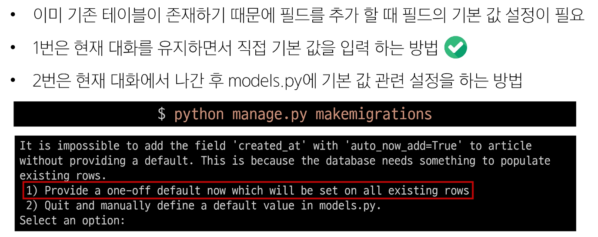
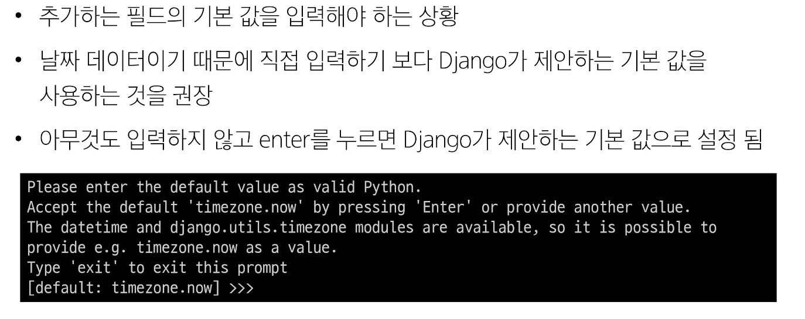
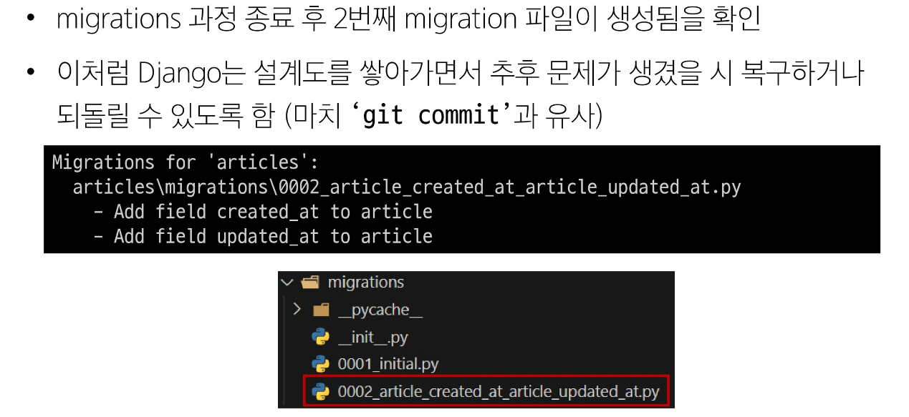
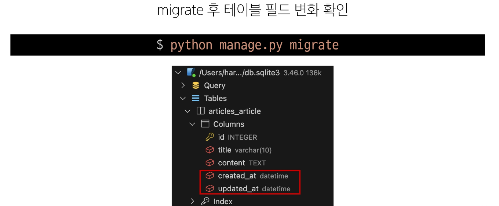

# Django Model 💻

> ### Model
> - DB의 테이블을 정의하고 데이터를 조작할 수 있는 기능들을 제공
> - 테이블 구조를 설계하는 '청사진(blueprint)'

> ### Model Field
> - DB테이블의 필드를 정의하며, 해당 필드에 저장되는 데이터 타입과 제약 조건을 정의
>> - 1. Field types : 데이터베이스에 저장될 데이터의 종류를 정의
>>      - CharField, TextField, IntegerField, DateField, FileField, ImageField
>> - 2. Field options : 필드의 동작과 제약 조건을 정의
>>      - null, blank, default

> ### Migrations 핵심 명령어
>> - model class 기반으로 최종 설계도 작성 
>> - $ python manage.py makemigrations
>> - 최종 설계도를 DB에 전달하여 반영
>> - $ python manage.py migrate
> - auto_now : 데이터가 저장될 때마다 자동으로 현재 날짜시간을 저장(수정일)
> - auto_now_add : 데이터가 처음 생성될 때만 자동으로 현재 날짜 시간을 저장(수정일 갱신 x, 작성일)
> - 
> - 새로 만들어지는 컬럼은 무조건 값을 가지고 생성-> 무결성의 원칙
> - 
> - 
> - 
>> - model class에 변경사항이 생겼다면 반드시 새로운 설계도를 생성하고, 이를 DB에 반영해야 한다.
>> - model class 변경 -> makemigrations -> migrate

> ### Automatic admin interface
> - Django가 추가 설치 및 설정 없이 자동으로 제공하는 관리자 인터페이스 (데이터 확인 및 테스트 등을 진행하는데 매우 유용)
>> - 1. admin 계정 생성
>>      - $ python manage.py createsuperuser
>>      - email은 선택사항, 비밀번호 입력 시 보안상 터미널에 출력되지 않으니 무시하고 입력 이어가기
>> - 2. DB에 생성된 admin 계정 확인
>> - 3. admin에 모델 클래스 등록
>>      - admin.py에 장성한 모델 클래스를 등록해야만 admin site에서 확인 가능
>>      - admin.site.register(Article)
>> - 4. admin site 로그인 후 등록된 모델 클래스 확인
>> - 5. 데이터 생성, 수정, 삭제 테스트
>> - 6. 테이블 확인