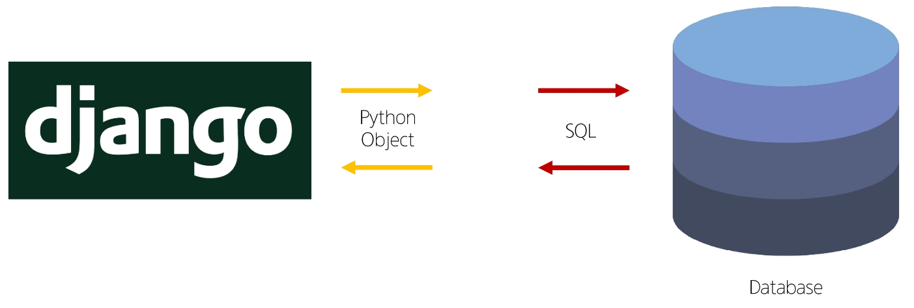
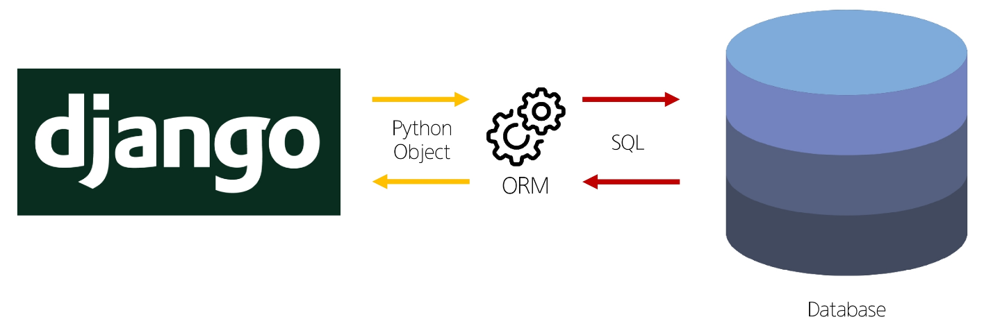
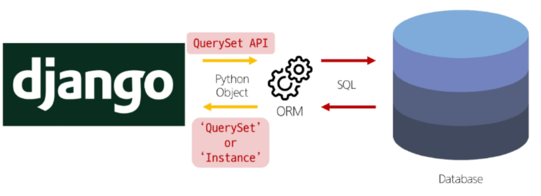
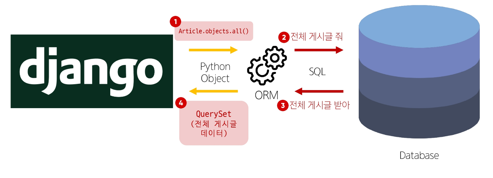
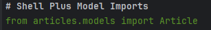
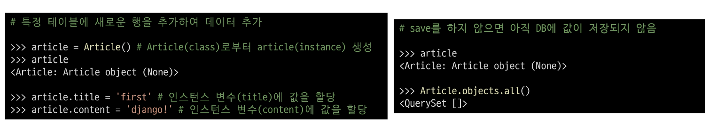
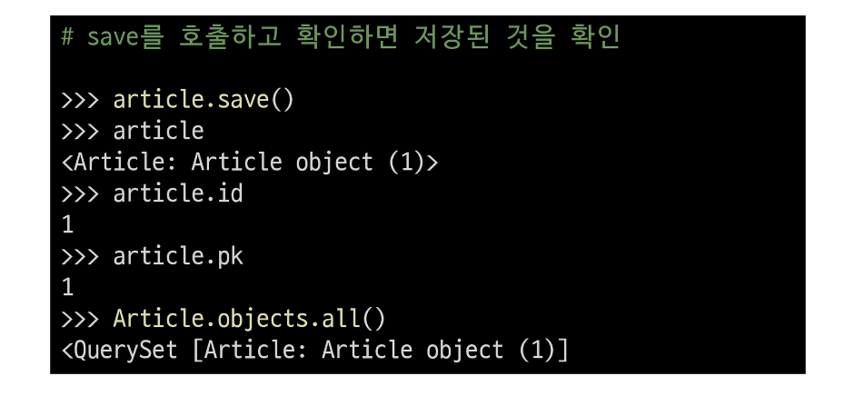
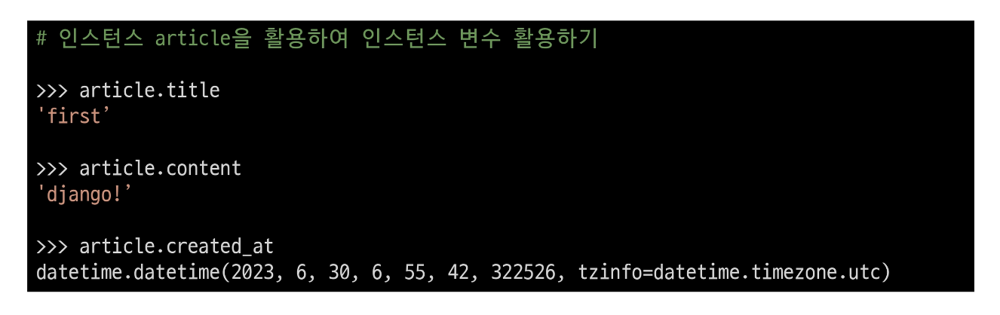

# ORM(Object-Relational-Mapping)💻

> ### 개념
> - 객체 지향 프로그래밍 언어를 사용하여 호환되지 않는 유형의 시스템 간에 데이터를 변환하는 기술

> 
> 

> ### QuerySet API
> - ORM에서 데이터를 검색, 필터링, 정렬 및 그룹화 하는데 사용하는 도구
>   - API를 사용하여 SQL이 아닌 Python 코드로 데이터를 처리
>> - 기본적인 QuerySet API 구문
>> - Article[Model class].objects[Manager].all()[Queryset API]

> 
> 

> ### Query
> - 데이터베이스에게서 전달받은 객체 목록(데이터 모음)
>   - 순회가 가능한 데이터로써 1개 이상의 데이터를 불러와 사용할 수 있음
> - Django ORM을 통해 만들어진 자료형
> - 단, 데이터베이스가 단일한 객체를 반환할 때는 QuerySet이 아닌 모델(Class)의 인스턴스로 반환됨

> ### QuerySet API
> - python의 모델 클래스와 인스턴스를 활용해 DB에 데이터를 저장, 조회, 수정, 삭제하는 것
> - CRUD : Create, Read, Update, Delete
>> - $ pip install ipython
>> - $ pip install django-extensions
>> - $ python manage.py shell_plus ->  Django 환경 안에서 실행되는 python shell, (클래스 자동 import)
>> - 

> - 데이터 객체를 생성하는 3가지 방법
>> 
>> 
>> 

> ### 조회
> - all() : 전체 데이터 조회, Article.objects.all()
> - filter() : 주어진 매개변수와 일치하는 객체를 포함하는 QuerySet 반환, Article.objects.filter(content = '일치하는 단어')
>   - 특정 조건을 만족하지 않아도 비어있는 쿼리를 반환 => QuerySet = []
> - get() : 주어진 매개변수와 일치하는 객체를 반환, Article.objects.get(pk = 1)
>   - 특정 조건을 만족하지 않으면 Does Not Exist 예외 발생
>   - 반환 값이 둘 이상이라면 MultipleObjectsReturned 예외 발생
>   - primary key와 같이 고유성(uniqueness)을 보장하는 조회에서 사용 

> ### Field lookups
> - Query에서 조건을 구성하는 방법
> - QuerySet 메서드 filter(), exclude() get()에 대한 키워드 인자로 지정됨
> - Article.objects.filter(content__contains='aaa'), 'aaa'이 포함된 모든 게시글 조회
> - Article.objects.filter(title__startswith='he'), 제목이 'he'로 시작하는 모든 게시글 조회