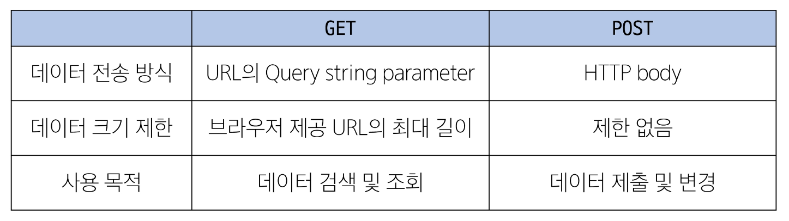
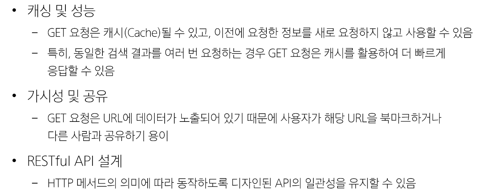
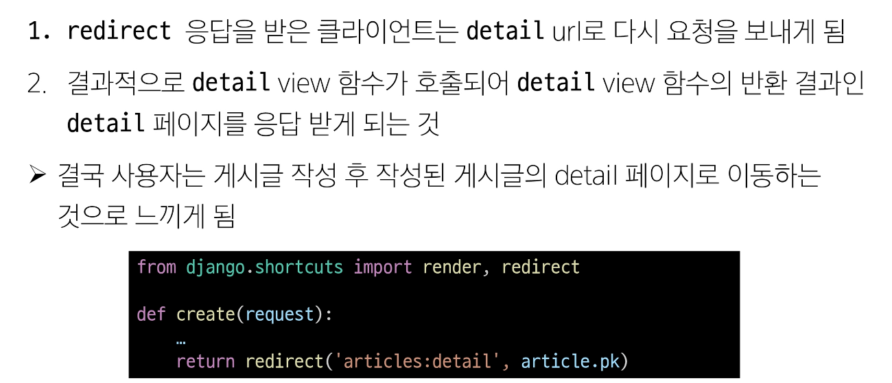
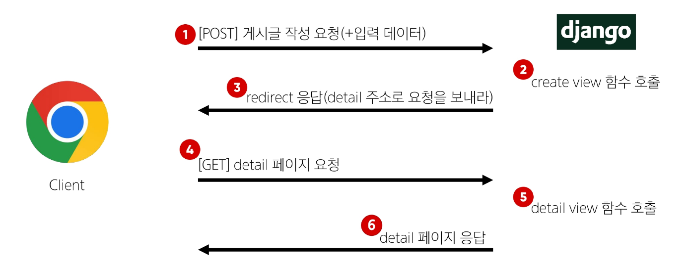

# ORM(Object-Relational-Mapping with View)💻

> ### HTTP
> - 네트워크 상에서 데이터(리소스)를 주고 받기 위한 약속

> ### HTTP request methods
> - 데이터에 대해 수행을 원하는 작업(행동)을 나타내는 것
>   - 서버에게 원하는 작업의 종류를 알려주는 역할
> - 클라이언트가 웹 서버에 특정 동적을 요청하기 위해 사용하는 표준 명령어
> - 대표 메서드 : GET, POST

> ### ***GET*** Method
> - 서버로부터 데이터를 요청하고 받아오는 데(조회) 사용
> - 1. 데이터 전송 : URL의 쿼리 문자열을 통해 데이터를 전송
> - 2. 데이터 제한 : URL 길이에 제한이 있어 대량의 데이터 전송에는 적합하지 않음
> - 3. 브라우저 히스토리 : 요청 URL이 브라우저 히스토리에 남음
> - 4. 캐싱 : 브라우저는 GET 요청의 응답을 로컬에 저장할 수 있음, 동일한 URL로 요청시 저장된 결과를 사용 ->  페이지 로딩 시간 단축
> - ex. 검색 쿼리 전송, 웹 페이지 요청, API에서 데이터 조회

> ### ***POST*** Method
> - 서버에 데이터를 제출하여 리소스를 변경(생성, 수정, 삭제) 하는 데 사용
> - 1. 데이터 전송 : HTTP Body를 통해 데이터를 전송
> - 2. 데이터 제한 : GET에 비해 더 많은 양의 데이터를 전송할 수 있음
> - 3. 브라우저 히스토리 : POST 요청은 브라우저 히스토리에 남지 않음
> - 4. 캐싱 : POST요청은 기본적으로 캐시 할 수 없음, 일반적으로 서버의 상태를 변경하는 작업을 수행하기 때문
> - ex. 로그인 정보 제출, 파일 업로드, 새 데이터 생성(새로운 게시글 작성), API에서 데이터 변경 요청

> 
> 

> ### CSRF, cross-site-request-forgery
> - 사이트 간 요청 위조
> - 사용자가 자신의 의지와 무관하게 공격자가 의도한 행동을 하여 특정 웹 페이지를 보안에 취약하게 하거나 수정, 삭제 등의 작업을 하게 만드는 공격 방법
>> - CSRF Token 적용
>> - 사용자에게 토큰 값을 부여하여 요청 시 토큰 값도 함께 서버로 전송될 수 있도록 하는 것
>> - 직접 제공한 페이지에서 데이터를 작성하고 있는 것인지에 대한 확인 수단이 필요한 것
>> - 겉모습이 똑같은 위조 사이트나 정상적이지 않은 요청에 대한 방어 수단
>> - request + token -> 게시글 작성
> - 왜 POST일 때만 Token을 확인할까?
>> - DB에 조작을 가하는 요청은 반드시 인증 수단이 필요
>> - 데이터베이스에 대한 변경사항을 만드는 요청이기 때문에 토큰을 사용해 최소한의 신원 확인을 하는 것

> ### HTTP response status code
> - 클라이언트에게 요청 처리 결과를 명확히 전달
> - 문제 발생 시 디버깅에 도움
> - 웹 애플리케이션의 동작을 제어하는 데 사용

> ### Redirect
> - 서버는 데이터 저장 후 페이지를 응답하는 것이 아닌 사용자를 적절한 기존 페이지로 보내야 한다.
> - 실제로 서버가 클라이언트를 직접 다른 페이지로 보내는 것이 아닌 클라이언트가 GET요청을 한 번 더 보내도록 응답하는 것
> #### 동작 원리
> 
> 