# Form Class 💻

> ### Django Form
> - 사용자 입력 데이터를 수집하고, 처리 및 유효성 검사를 수행하기 위한 도구
> - 유효성 검사를 단순화, 자동화 할 수 있는 기능을 제공

> - Form class 적용
> 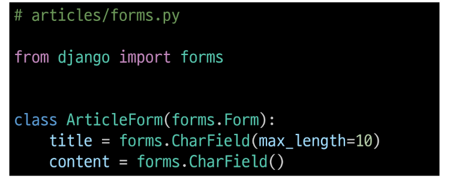
> 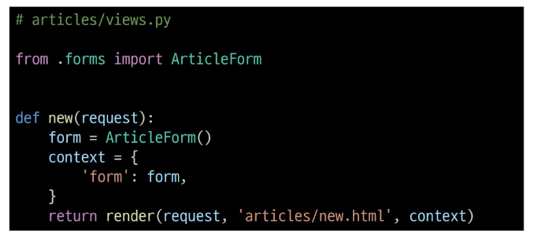
> 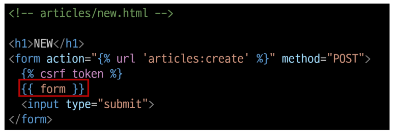

> - Form rendering options
> - lable, input 쌍을 특정 HTML 태그로 감싸는 옵션
> 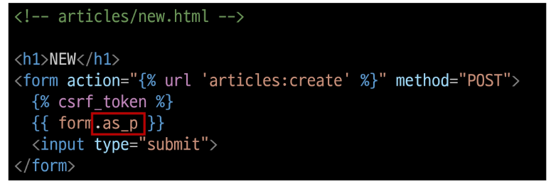

> - Widgets
> - HTML 'input' elements의 표현을 담당, 단순히 출력 부분을 변경하는 것
> 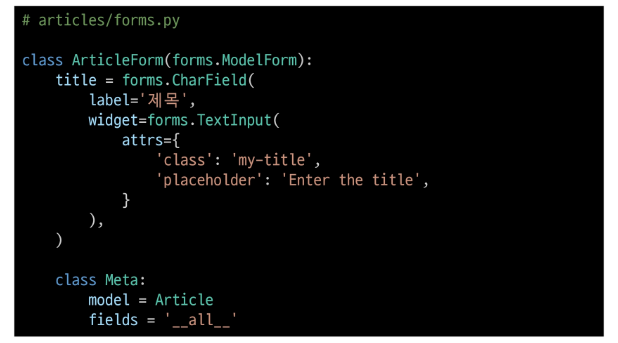
> 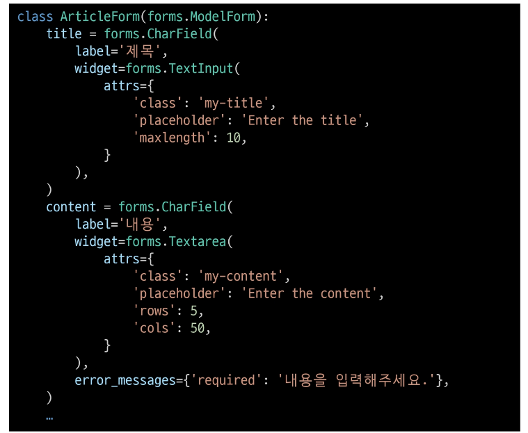

> ### ModelForm
>> #### Form
>> - 사용자 입력 데이터를 DB에 저장하지 않을 때(ex. 검색, 로그인)
>> #### ModelForm
>> - 사용자 입력 데이터를 DB에 저장해야 할 때(ex. 게시글 작성, 회원가입)
>> - Model과 연결된 Form을 자동으로 생성해주는 기능을 제공, Form + Model
>> ##### is_valid()
>> - 여러 유효성 검사를 실행하고, 데이터가 유효한지 여부를 Boolean으로 반환
>> - 별도로 명시하지 않았지만 모델 필드에는 기본적으로 빈 값은 허용하지 않는 제약조건이 설정되어 있음
>> - 빈 값은 is_valid()에 의해 False로 평가되고 form객체에는 그에 맞는 에러 메세지가 포함되어 다음 코드로 진행됨.

> ### Meta data
> - 데이터의 데이터를 의미
> - ex) 사진(데이터)을 찍고 저장 -> 사진 데이터 안의 위치, 조리개 값, 조도, 타입, 기종, 렌즈, 시간를 의미

> ### Meta class
> - ModelForm 정보를 작성
> 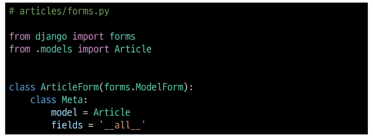
> - 'fields', 'exclude' 속성, exclude 속성을 사용하여 모델에서 포함하지 않을 필드를 지정할 수 있음
> 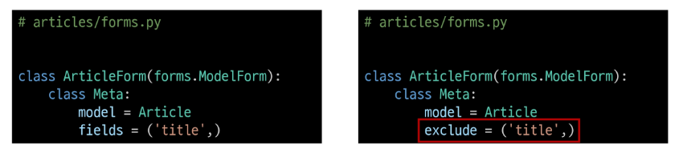
>> - 주의 사항
>> - Django에서 ModelForm에 대한 추가 정보나 속성을 작성하는 클래스 구조를 Meta 클래스로 작성 했을 뿐이며, python의 inner class와 같은 문법적인 관점으로 접근하지 말 것.

> ### HTTP 요청 다루기
> - new method & create method
> - 공통점 : 데이터 생성 구현
> - 차이점 : new : GET request, create: POST request
>> - HTTP request method 차이점을 활용해 동일한 목적을 가지는 2개의 view 함수를 하나로 구조화 
 
> - 유효성 검사를 통과하지 못하였을 때도 존재, context를 마지막에 위치시킴
> 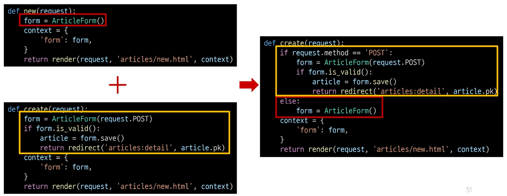
>> - request method에 따른 요청의 변화
>> 

> ### ModelForm의 키워드 인자 구성
> - data는 첫번째에 위치한 키워드 인자이기 때문에 생략 가능, 부모의 생성자 함수에 맞춰서 인자 구성
> - instance는 9번째에 위치한 키워드 인자이기 때문에 생략할 수 없었음
>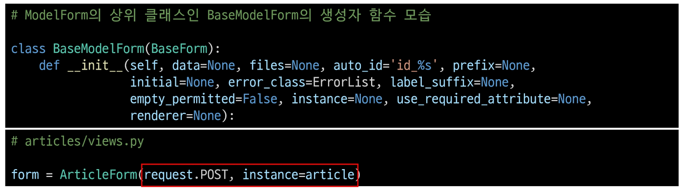

> - 필드 수동으로 렌더링하는 법
> 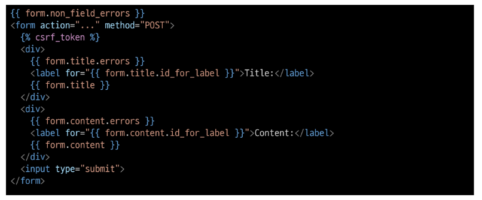