# Static Files 💻

> ### Static Files, 정적 파일
> 
> 
> - 서버 측에서 변경되지 않고 고정적으로 제공되는 파일 (이미지, JS, CSS file 등)

>> - static file 기본 경로 : app/static
>> 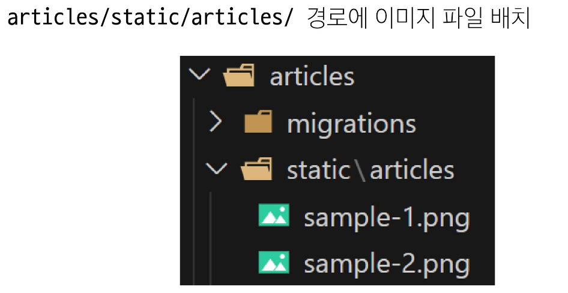
>> 
>> 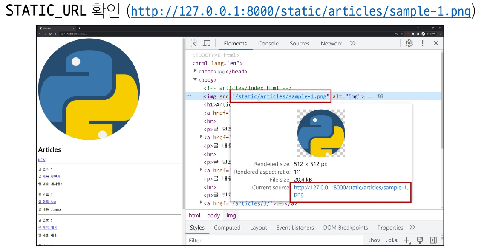
>> - static_url : 기본 경로 및 추가 경로에 위치한 정적 파일을 참조하기 위한 URL(실제 경로가 아니며, URL로만 존재)
>> 
>> - static files 추가 경로 : STATICFILES_DIRS에 문자열 값으로 추가 경로 설정
>> - STATICFILES_DIRS : 정적 파일의 기본 경로 외에 추가적인 경로 목록을 정의하는 리스트
>> 
>> 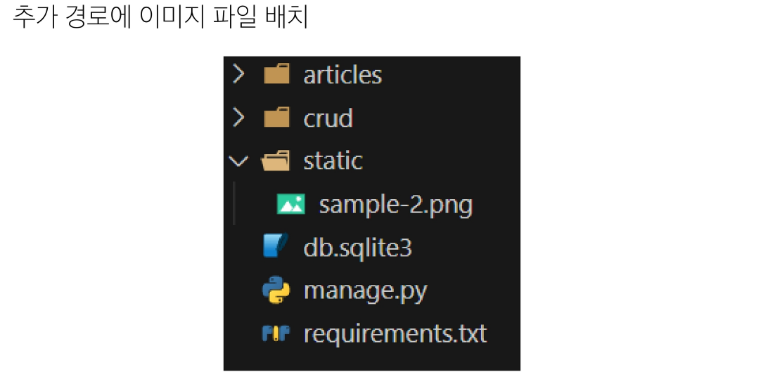
>> 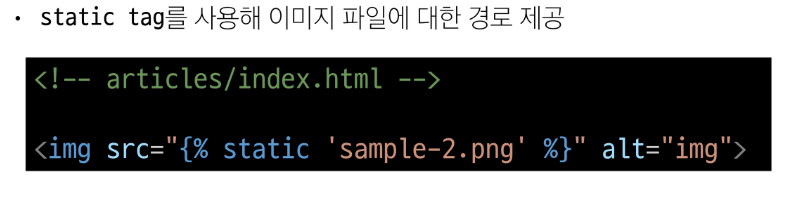
>> 

>> - 정적 파일을 제공하려면 요청에 응답하기 위한 URL이 필요

> #### Media Files
> - 사용자가 웹에서 업로드하는 정적 파일(user-uploaded)
>> - ImageField() : 이미지 업로드에 사용하는 모델 필드, 이미지 객체가 직접 DB에 저장되는 것이 아닌 '이미지 파일 경로' 문자열이 저장됨.
>> 
>> 
>> 
>> 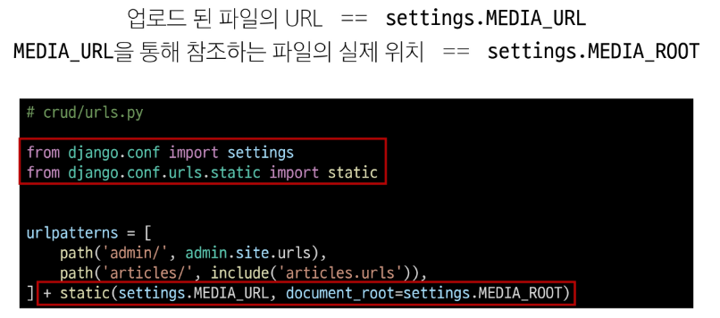

> #### 이미지 업로드
> 
> 
> 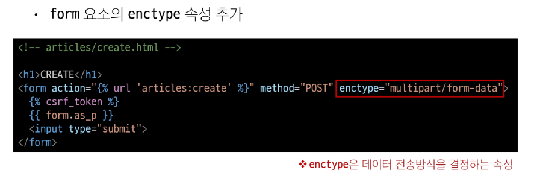
> 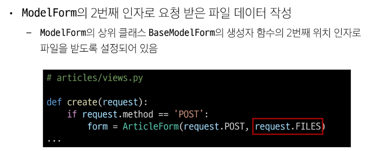
> 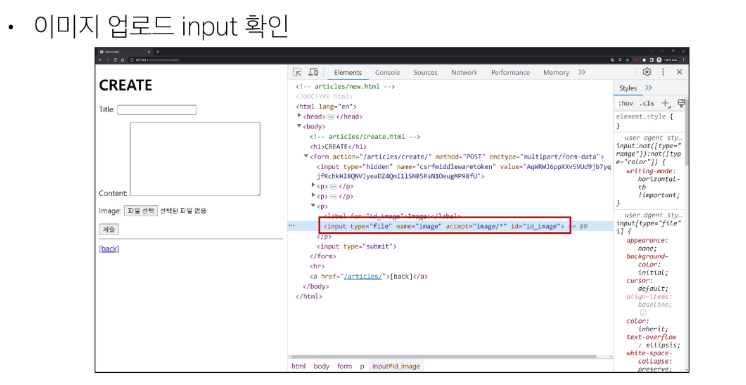
> 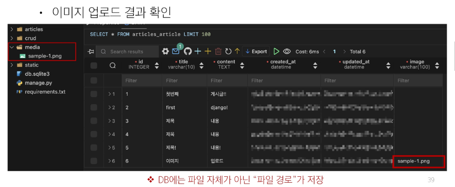

> #### 업로드 이미지 제공하기
> 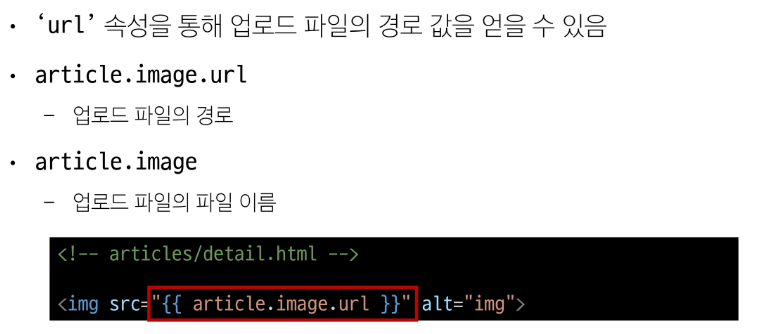
> 
> 

> #### 업로드 이미지 수정
> 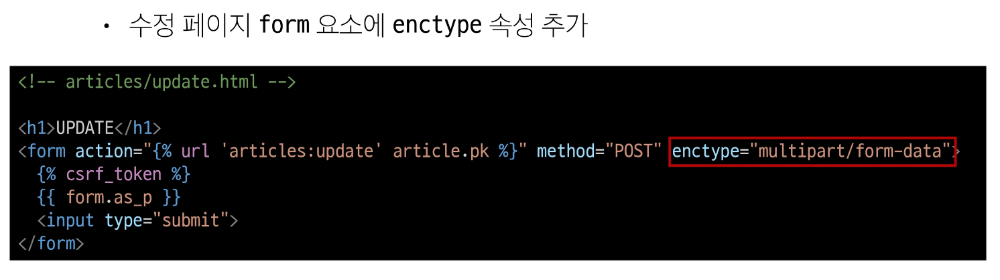
> 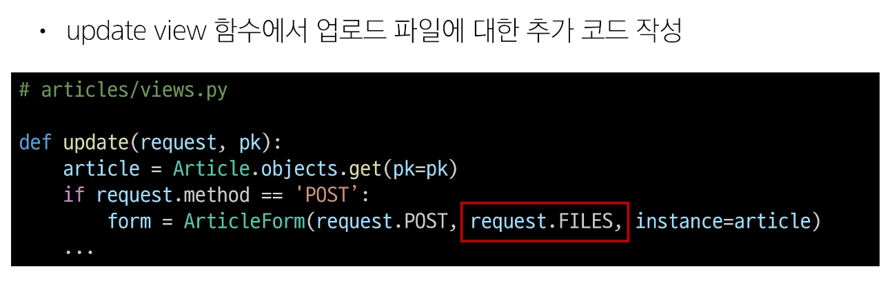

> #### 미디어 파일 추가 경로
> 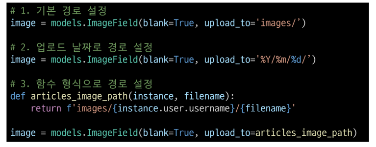
> - 'upload_to' argument : ImageField()의 upload_to 속성을 사용해 다양한 추가 경로 설정
> 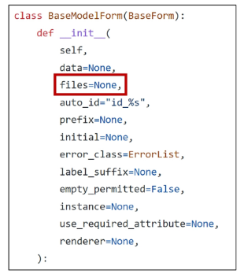
> - request.FILES가 두번째 위치 인자인 이유 : ModelForm의 상위 클래스 BaseModelForm의 생성자 함수 키워드 인자
