# Authhentication System 💻

> ### HTTP
> 
> - HTML 문서와 같은 리소스들을 가져올 수 있도록 해주는 규약, 웹(www)에서 이루어지는 모든 데이터 교환의 기초
>> - 1. 비연결 지향(connectionless): 서버는 요청에 대한 응답을 보낸 후 연결을 끊음
>> - 2. 무상태(stateless): 연결을 끊는 순간 클라이언트와 서버 간의 통신이 끝나며 상태 정보가 유지되지 않음

> ### Cookie
> - 서버가 사용자의 웹 브라우저에 전송하는 작은 데이터 조각
> - 서버가 제공하여 클라이언트 측에서 저장되는 작은 데이터 파일
> - 사용자 인증, 추적, 상태 유지 등에 사용되는 데이터 저장 방식

>> #### 쿠키 동작 예시
> 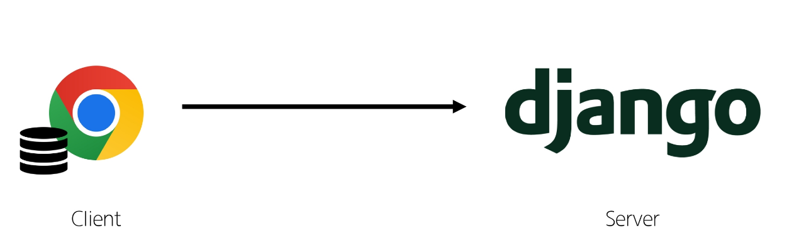
> - 1. 브라우저가 웹 서버에 웹 페이지를 요청
> 
> - 2. 웹 서버는 요청된 페이지와 함께 쿠키를 포함한 응답을 브라우저에게 전송
> 
> - 3. 브라우저는 받은 쿠키를 저장소에 저장 쿠키의 속성(만료 시간, 도메인, 주소 등)도 함께 저장됨
> 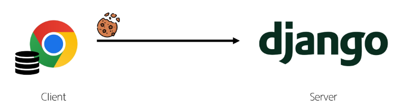
> - 4. 이후 브라우저가 같은 웹 서버에 웹 페이지를 요청할 때, 저장된 쿠키 중 해당 요청에 적용 가능한 쿠키를 포함하여 전송
> 
> - 5. 웹 서버는 받은 쿠키 정보를 확인하고, 필요에 따라 사용자 식별, 세션 관리 등을 수행
> 
> - 6. 웹 서버는 요청에 대한 응답을 보내며, 필요한 경우 새로운 쿠키를 설정하거나 기존 쿠키를 수정할 수 있음.

> #### 쿠키의 작동 원리와 활용
> - 1. 쿠키 저장 방식
>   - 브라우저(클라이언트)는 쿠키를 key-value 형식으로 저장
>   - 쿠키에는 이름, 값 외에도 만료 시간, 도메인 경로 등의 추가 속성이 포함 됨
> - 2. 쿠키 전송 과정
>   - 서버는 HTTP 응답 헤더의 Set-Cookie 필드를 통해 클라이언트에게 쿠키 전송
>   - 브라우저는 받은 쿠키를 저장해 두었다가, 동일한 서버에 재요청 시 HTTP 요청 Header의 Cookie 필드에 저장된 쿠키를 함께 전송
> - 3. 쿠키의 주요 용도
>   - 두 요청이 동일한 브라우저에서 들어왔는지 아닌지를 판단할 때 주로 사용됨
>   - 이를 이용해 사용자의 로그인 상태를 유지할 수 있음
>   - 상태가 없는 stateless HTTP 프로토콜에서 상태 정보를 기억시켜주는 역할
>> - 서버에게 '나 로그인 된 사용자야 ! '라는 인증 정보가 담긴 쿠키를 매 요청마다 계속 보내는 것

> #### 쿠키 사용 목적
> - 1. 세션 관리 : 로그인, 아이디 자동완성, 공지 하루 안보기, 팝업 체크, 장바구니 등의 정보 관리
> - 2. 개인화 : 사용자 선호 설정(언어, 테마 등) 저장
> - 3. 트래킹 : 사용자 행동을 기록 및 분석

> ### Session
> - 서버 측에서 생성되어 클라이언트와 서버 간의 상태를 유지, 상태 정보를 저장하는 데이터 저장 방식(쿠키에 세션 데이터를 저장하여 매 요청시마다 세션 데이터를 함께 보냄)

> #### 세션 작동 원리
> 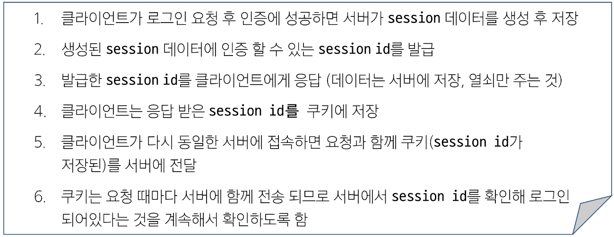

> - 서버 측에서는 세션 데이터를 생성 후 저장하고 이 데이터에 접근할 수 있는 세션 ID를 생성
> - ID를 클라이언트 측으로 전달
> - 클라이언트는 쿠키에 ID를 저장
> - 클라이언트가 같은 서버에 재요청 시마다 저장해 두었던 쿠키도 요청과 함께 전송 (ex. 로그인 상태 유지를 위해 로그인 되어 있다는 사실을 입증하는 데이터를 매 요청마다 계속해서 보내는 것)

> #### 쿠키와 세션의 목적
> - 클라이언트와 서버간의 상태 정보를 유지, 사용자 식별을 위해 사용

> ### Django Authentication System
> - Authentication (인증) : 사용자가 누구인지 확인하는 것(신원 확인)

> - #### 기본 User Model의 한계
> 
>> - User Model 대체의 필요성
>> 

> #### Custom User Model로 대체하기
> 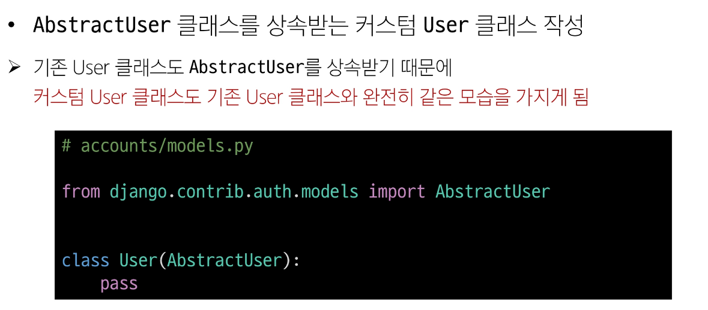
> 
> 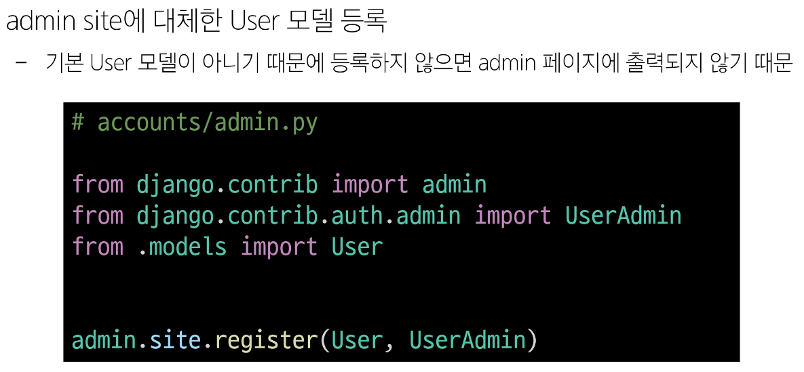

> ### AUTH_USER_MODEL
> - Django 프로젝트의 User를 나타내는 데 사용하는 모델을 지정하는 속성
> - 주의 !!! 프로젝트 중간에 AUTH_USER_MODEL을 변경 할 수 없음
> 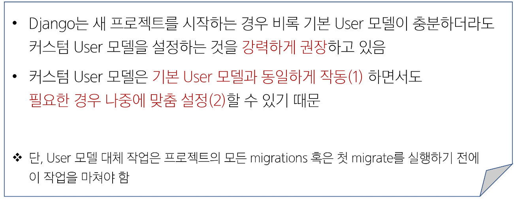

> ### Login
> - 로그인은 session을 create하는 과정
>> 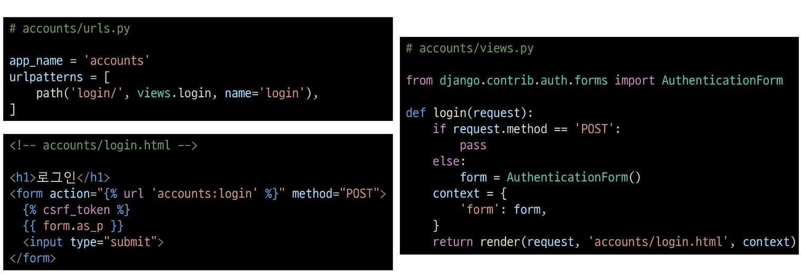
>> 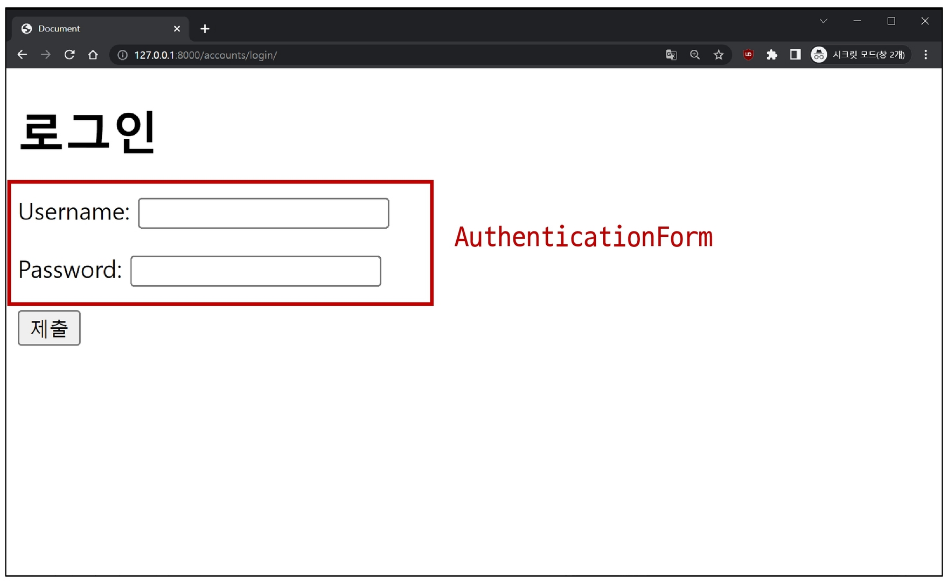
>> 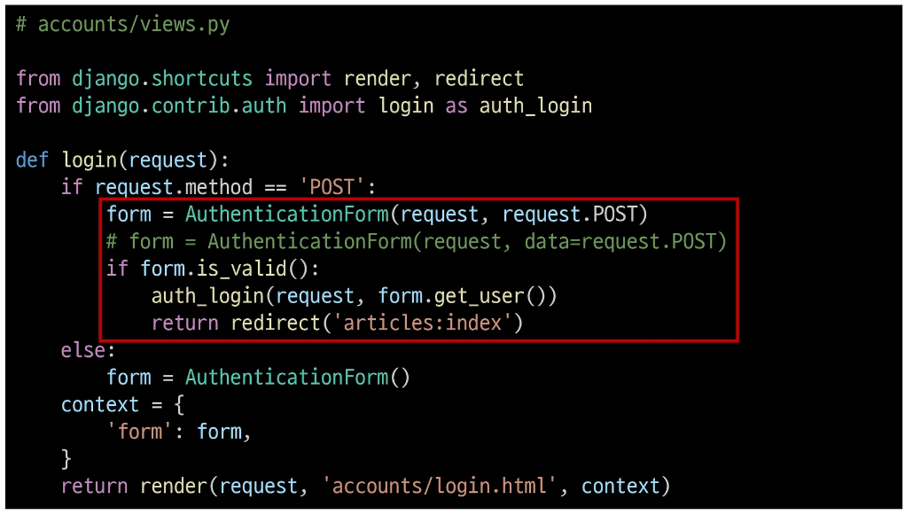

> #### AuthenticationForm()
> - 로그인 인증에 사용할 데이터를 입력 받는 built-in form
> - login(request, user) : AuthenticationForm을 통해 인증된 사용자를 로그인 하는 함수
> - get_user() : AuthenticationForm의 인스턴스 메서드, 유효성 검사를 통과했을 경우 로그인 한 사용자 객체를 반환

> ### Logout
> - Session을 Delete하는 과정
> 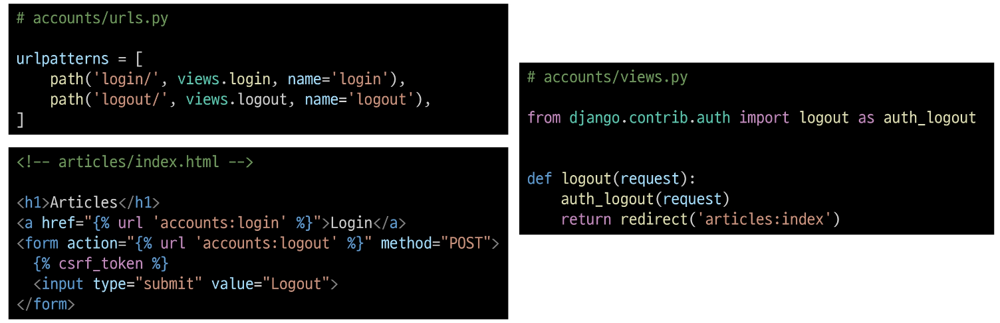
> 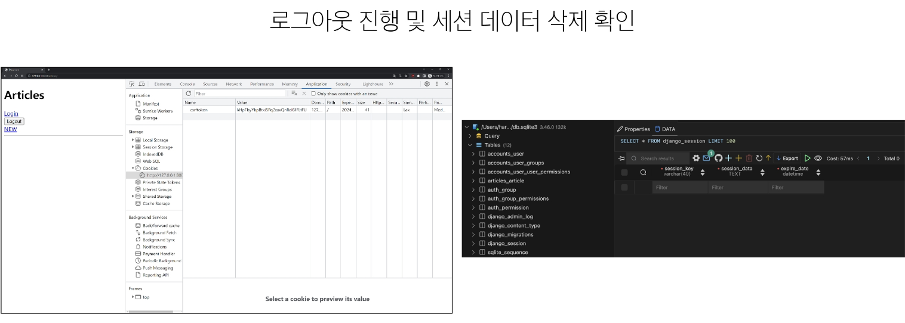
> - logout(request) : db에서 현재 요청에 대한 Session data삭제, 클라이언트 쿠키에서도 sessionId 삭제

> ### Template with Authentication data
> - 템플릿에서 인증 관련 데이터를 출력하는 방법
> 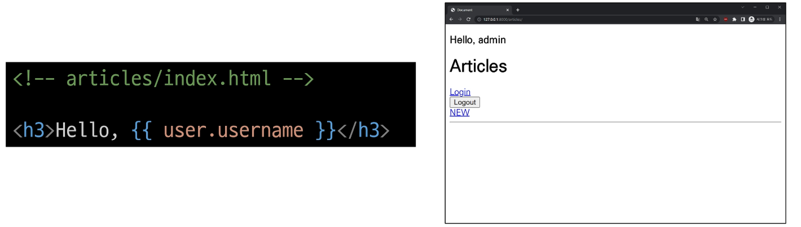
> - 현재 로그인 되어 있는 유저 정보 출력하기
>   - user라는 context 데이터를 사용할 수 있는 이유? django가 미리 준비한 context 데이터가 존재하기 때문(context processors)

> - context processors
> 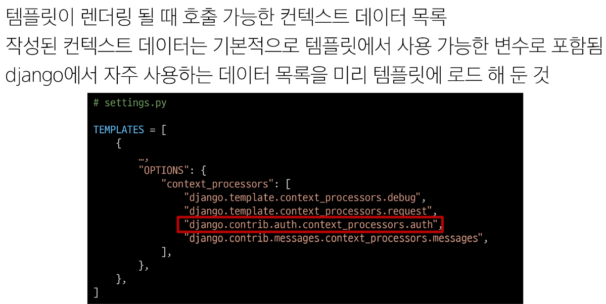

> #### 쿠키의 종류별 Lifetime
> - Session cookie : 현재 세션이 종료되면 삭제됨, 브라우저 종료와 함께 세션이 삭제됨
> - Persistent cookies : Expires 속성에 지정된 날짜 혹은 Max-Age 속성에 지정된 기간이 지나면 삭제됨

> ### 쿠키의 보안 장치
> 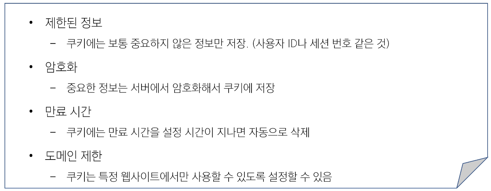
> - 많은 국가에서 쿠키 사용에 대한 사용자 동의를 요구하는 법규를 시행
> - 웹사이트는 쿠키 정책을 명시하고, 필요한 경우 사용자의 동의를 얻어야 함.

> #### session in Django
> 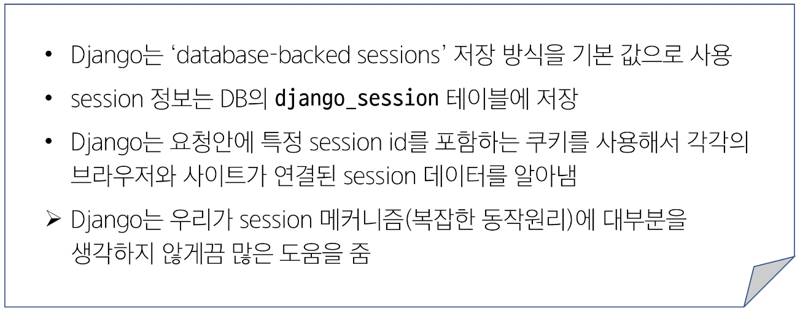

> #### 'AbstractUser' class
> 
> - 관리자 권한과 함께 완전한 기능을 가지고 있는 User model을 구현하는 추상 기본 클래스
> - Abstract base classes(추상 기본 클래스): 몇 가지 공통 정보를 여러 다른 모델에 넣을 때 사용하는 클래스, db 테이블을 만드는데 사용 x, 대신 다른 모델의 기본 클래스로 사용되는 경우 해당 필드가 하위 클래스의 필드에 추가 됨
