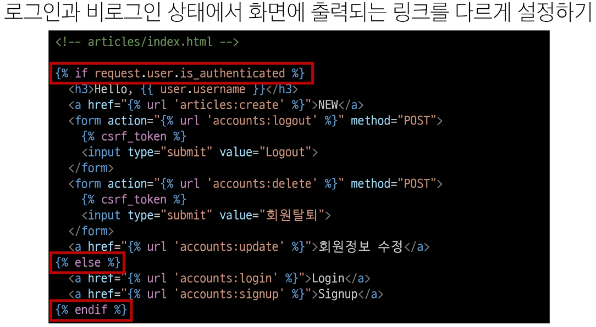
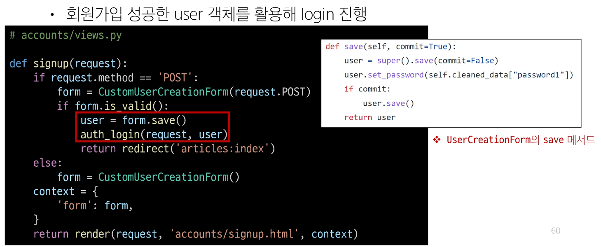

# Authhentication System 💻

> ### 회원 가입
> - User 객체에 Create 하는 과정
> - UserCreationForm() : 회원 가입 시 사용자 입력 데이터를 받는 built-in ModelForm

> #### 회원 가입 페이지 작성
> 
> 
> 
> 
> #### 회원 가입 로직 에러
> 
> 
> - 변경 후
> 

> ### 커스텀 유저 모델을 사용하려면 다시 작성해야 하는 Form
> 
> - 두 Form 모두 class Meta: model = User가 작성된 Form 이기 때문에 재작성 필요
> - UserCreationForm : 회원 가입 폼, UserChangeForm : 회원 수정 폼
> 
> 
> - get_user_model() : 현재 프로젝트에서 활성화된 사용자 모델(active user model)을 반환하는 함수
>> 

> ### 회원 탈퇴
> - User 객체를 Delete 하는 과정
> 
> 

> ### 회원 정보 수정
> - User 객체를 Update 하는 과정
> - UserChangeForm() : 회원정보 수정 시 사용자 입력 데이터를 받는 built-in ModelForm
> - ***비밀번호 수정***은 세션을 사용, 별도로 변경하는 폼이 필요함

> #### 회원 정보 수정 페이지 작성
> 
> 
> 
> - 변경 후
> 

> #### UserChangeForm 사용 시 문제점
> 
>> - CustomUserChangeForm 출력 필드 재정의
>> 
>> 

> ### 비밀번호 변경
> - 인증된 사용자의 Session 데이터를 Update 하는 과정
> - PasswordChangeForm() : 비밀번호 변경 시 사용자 입력 데이터를 받는 built-in Form

> #### 비밀번호 변경 페이지 작성
> 
> 
> 
> 

> ### 세션 무효화 방지
> - 비밀 번호 변경 시 세션 무효화
>   - 비밀번호가 변경되면 기존 세션과의 회원 인증 정보가 일치하지 않게되어 버려 로그인 상태가 유지되지 못하고 로그아웃 처리됨
>   - 비밀번호가 변경되면서 기존 세션과의 회원 인증 정보가 일치하지 않기 때문

> 
> 

> ### 인증된 사용자에 대한 접근 제한
> - 1. is_authenticated 속성
> - 2. login_required 데코레이터

> #### is_authenticated
> - 사용자가 인증 되었는지 여부를 알 수 있는 User model의 속성
> - 모든 User 인스턴스에 대해 항상 True인 읽기 전용 속성, 비인증 사용자에 대해서는 항상 False

> #### is_authenticated 적용
> 
> 
> - is_authenticated 속성 코드
> 

> #### login_required 데코레이터
> - 인증된 사용자에 대해서만 view 함수를 실행시키는 데코레이터
> - 비인증 사용자의 경우 /accounts/login/ 주소로 redirect 시킴 : > 인증에 대한 클래스를 accounts로 설정해야 하는 이유 !

> #### login_required 적용
> 
> 

> ### 회원 가입 후 자동 로그인
> - 회원 가입 후 로그인까지 이어서 진행하려면?
> 

> ### 회원 탈퇴 개선
> - 탈퇴와 함께 시존 사용자의 Session Data 삭제 방법
> 

> ### PasswordChangeForm 인자 순서
> 