# DRF 01 💻

> ### Django REST framework (DRF)
> 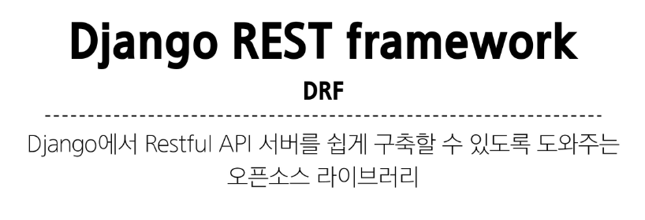
> 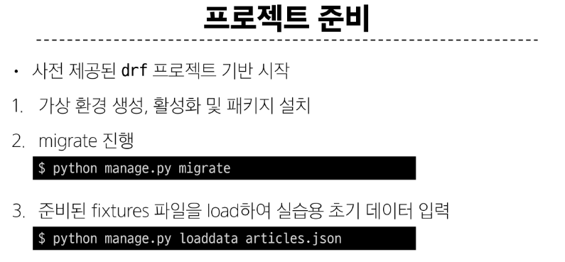

> ### Serialization
> 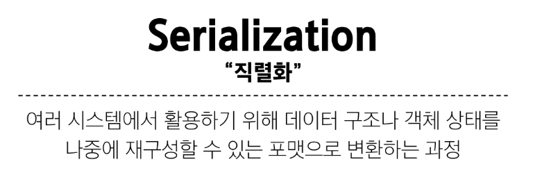
> 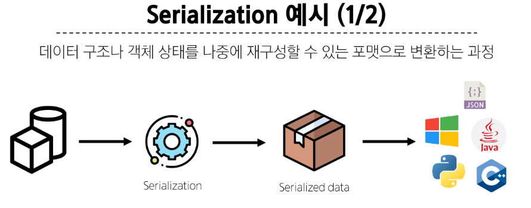
> 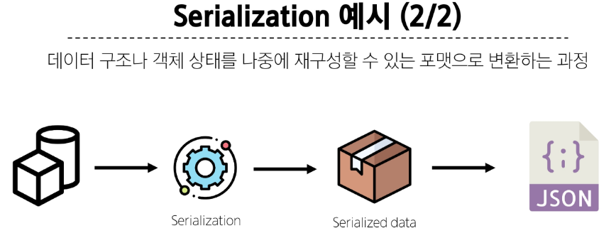
> 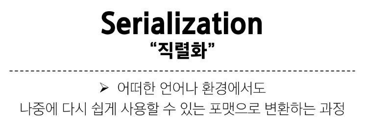
> 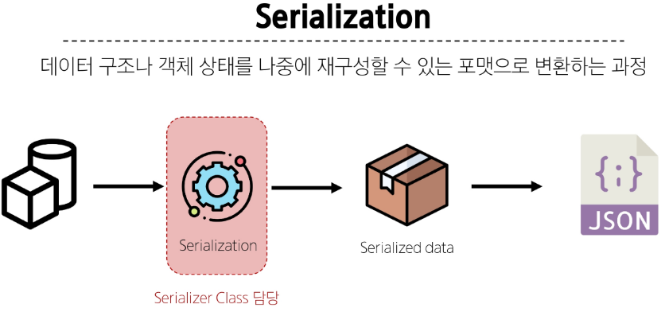
> 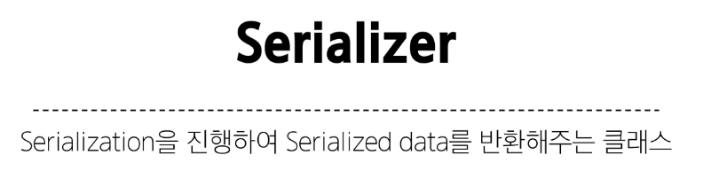
> 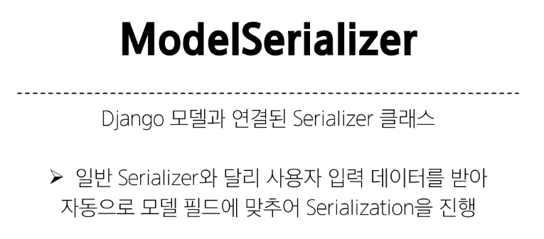
> 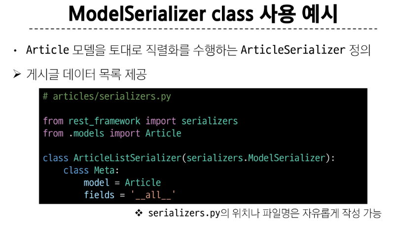

> ### CRUD with ModelSerializer
> 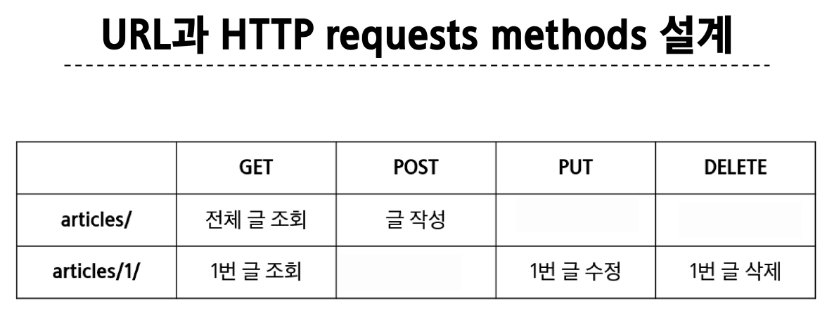

> #### GET
> 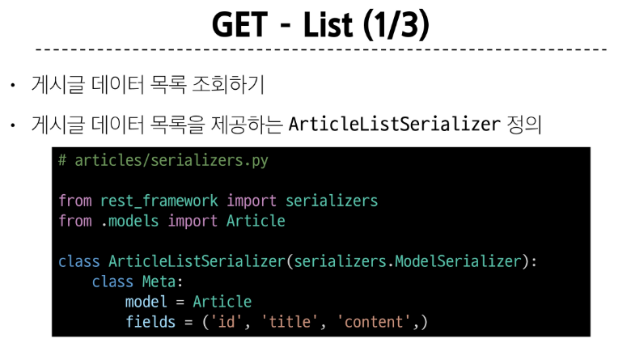
> 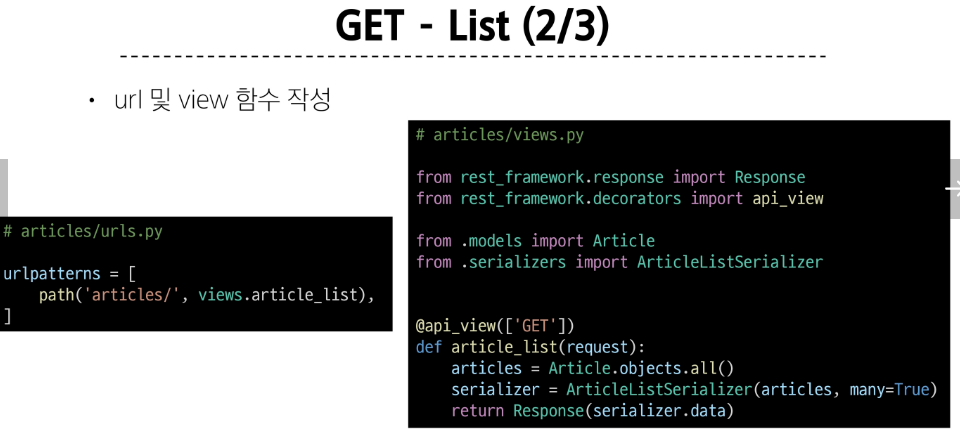
> 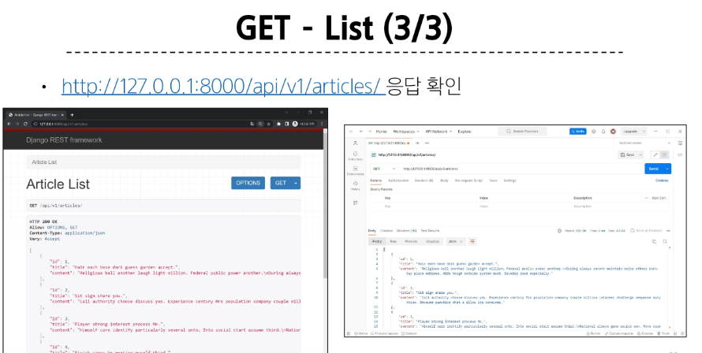
> 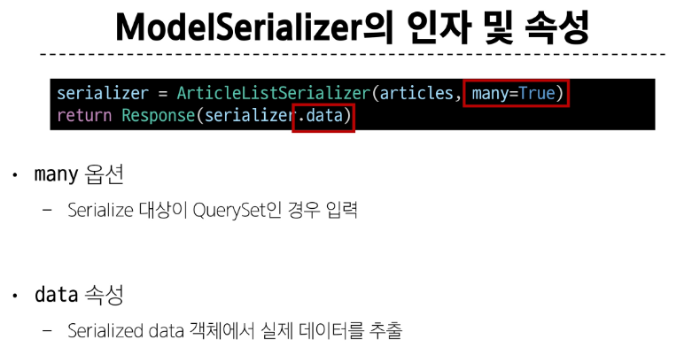
> 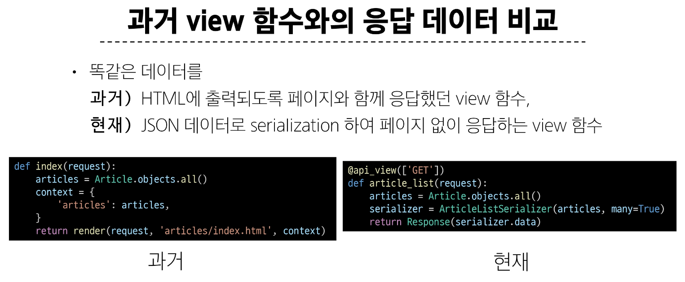
> 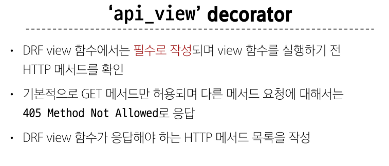
> 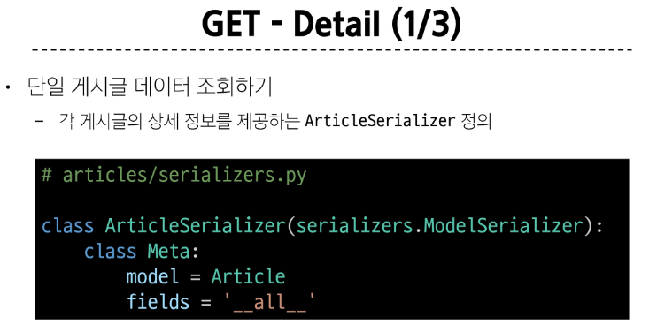
> 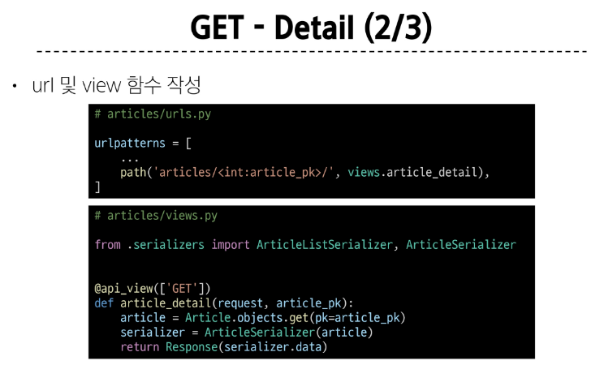
> 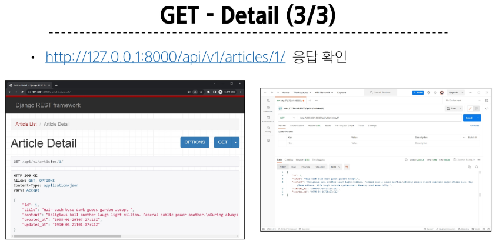

> #### POST
> 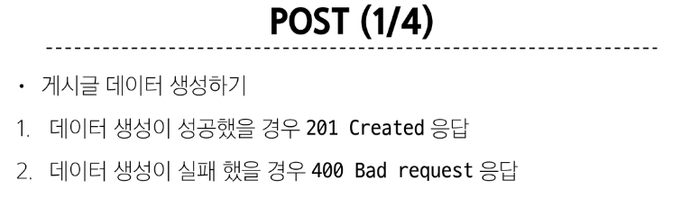
> 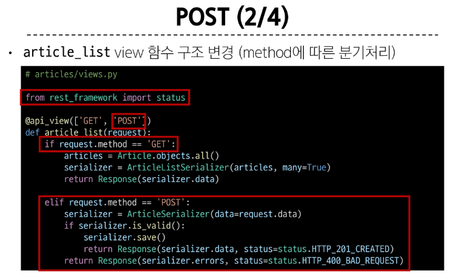
> 
> 

> #### DELETE
> 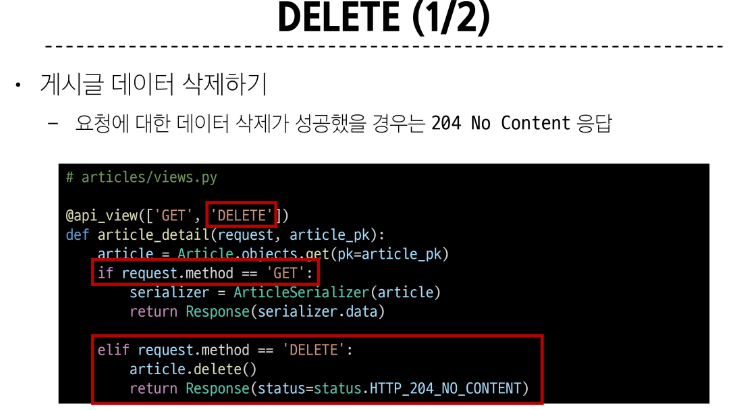
> 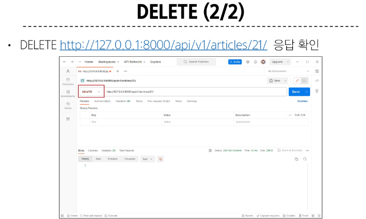

> #### PUT
> 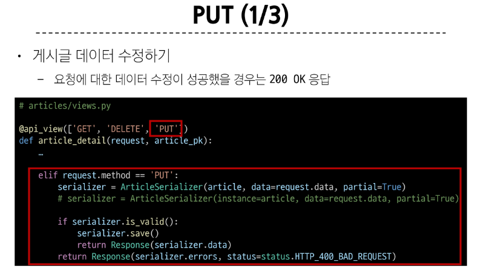
> 
> 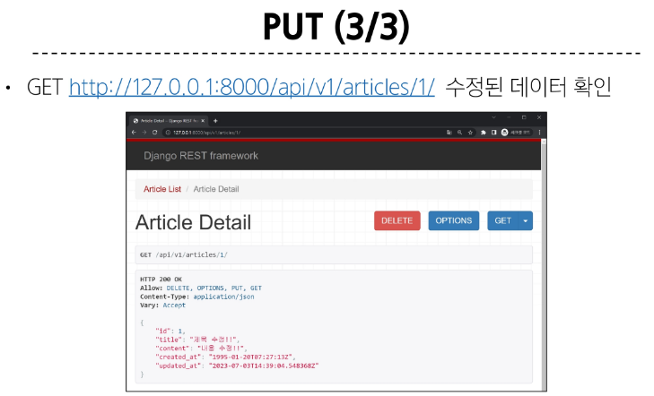
> 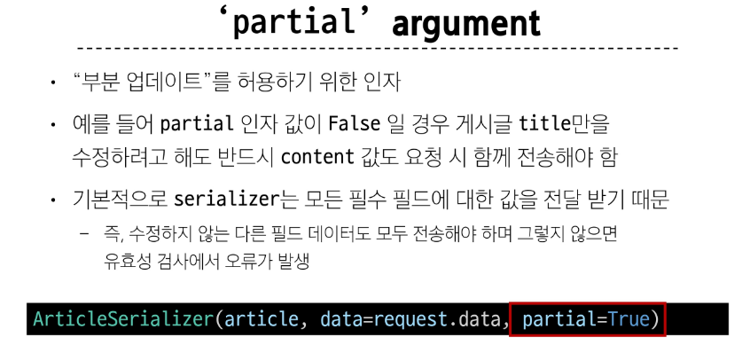

> #### raise_exception
> 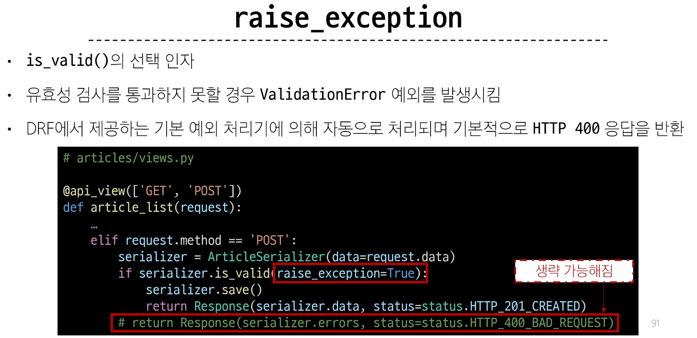