# REST_API 01 💻

> ### API
> 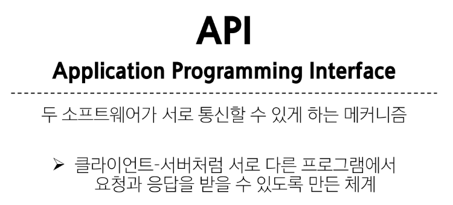
> 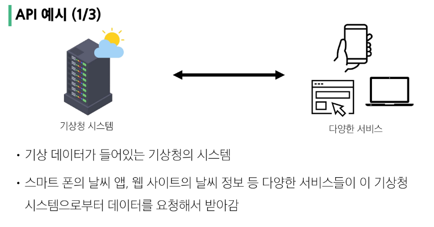
> 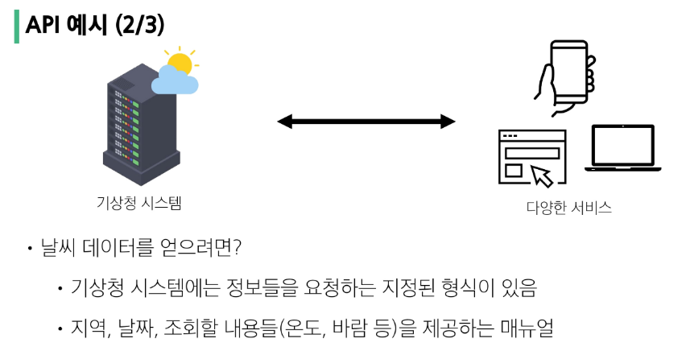
> 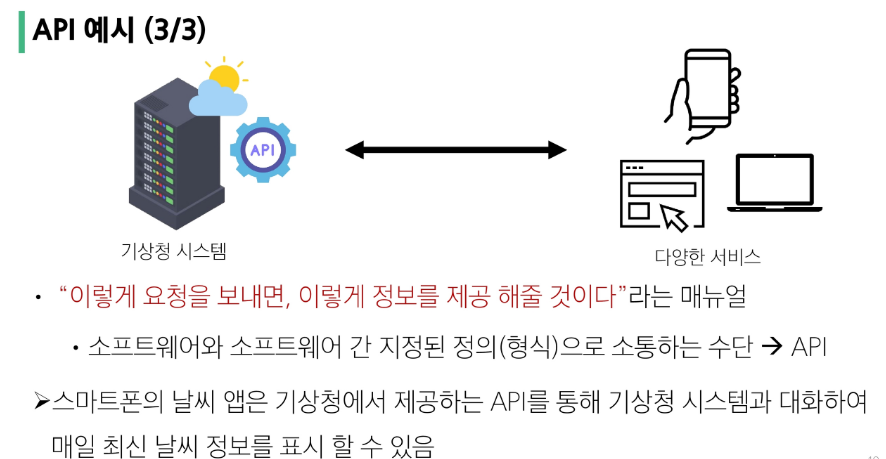
> 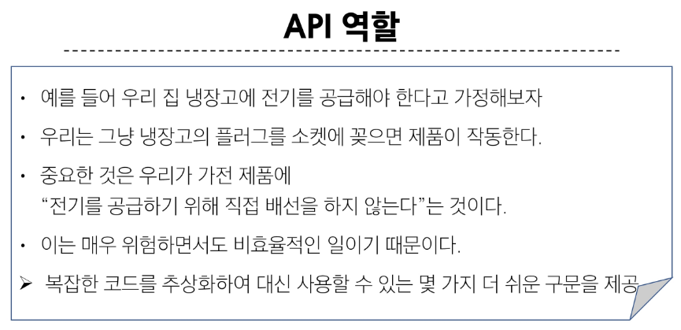
> 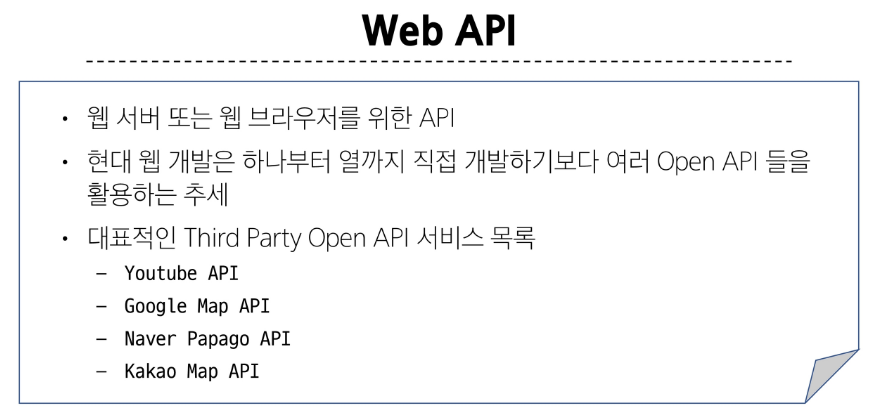

> ### REST API
> 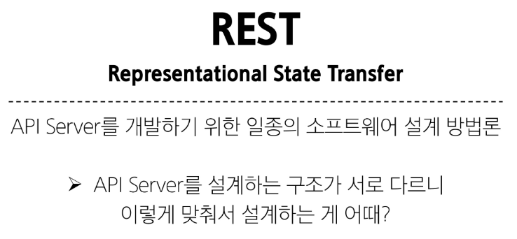
> 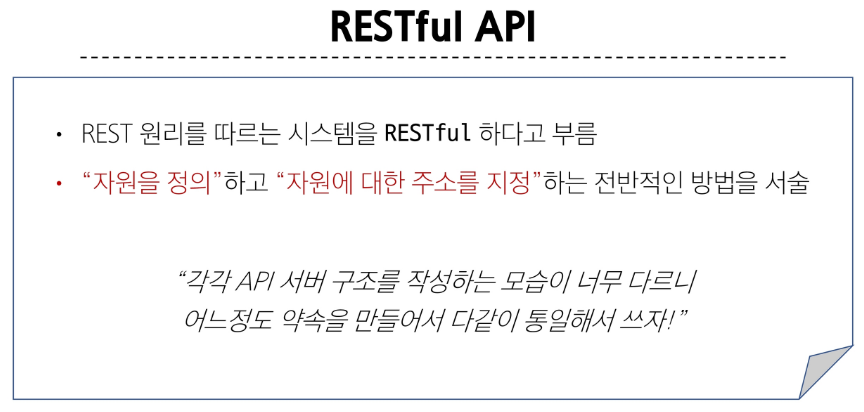
> 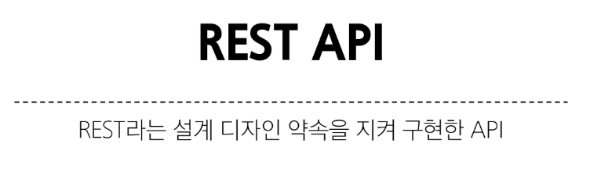
> 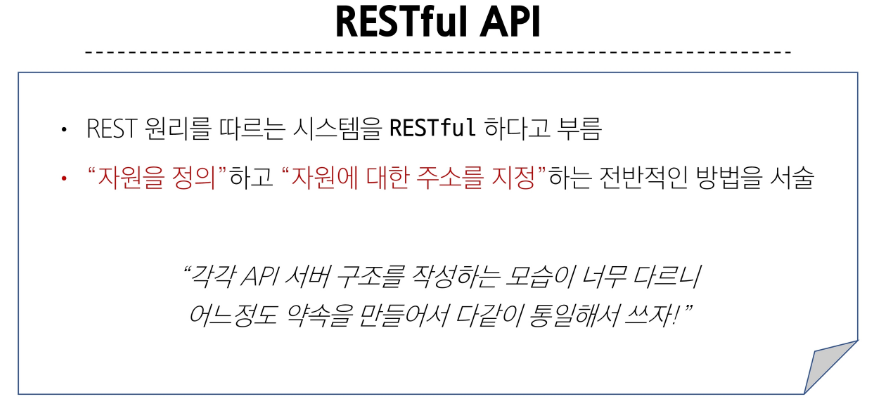
> 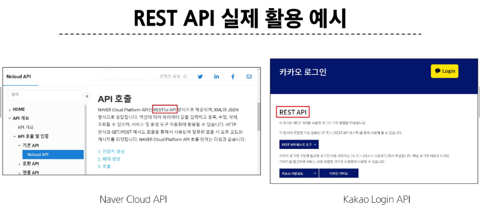
> 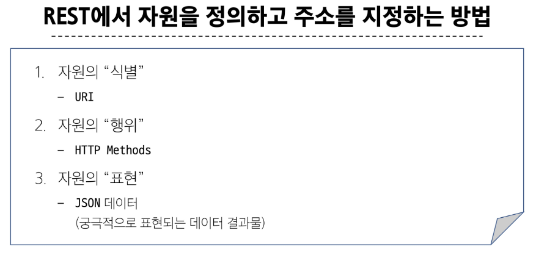

> ### 자원의 식별
> 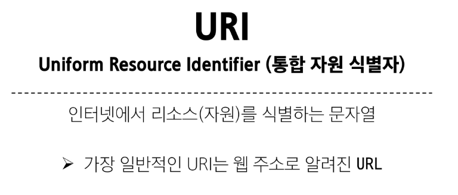
> 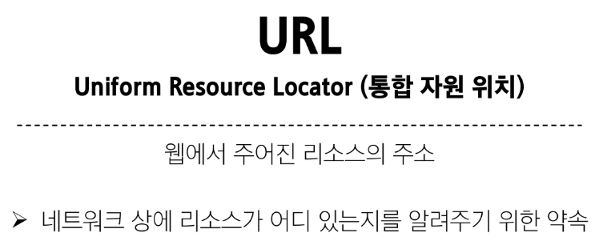
> 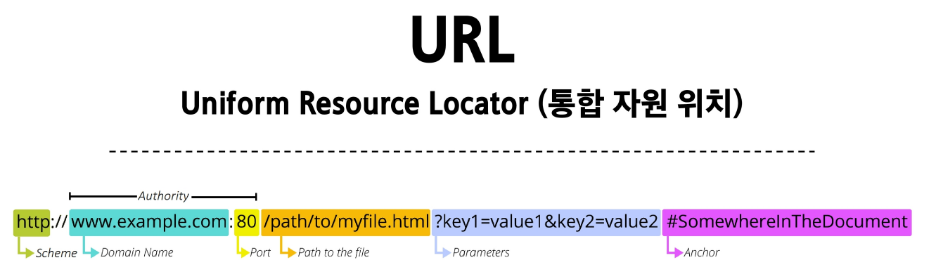
> 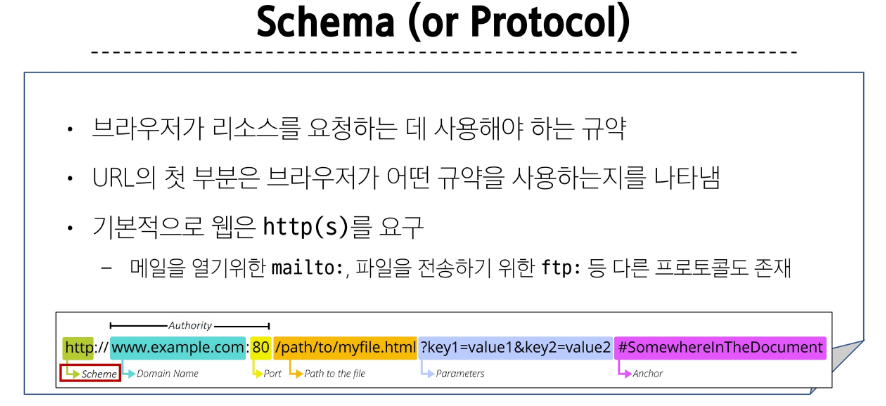
> 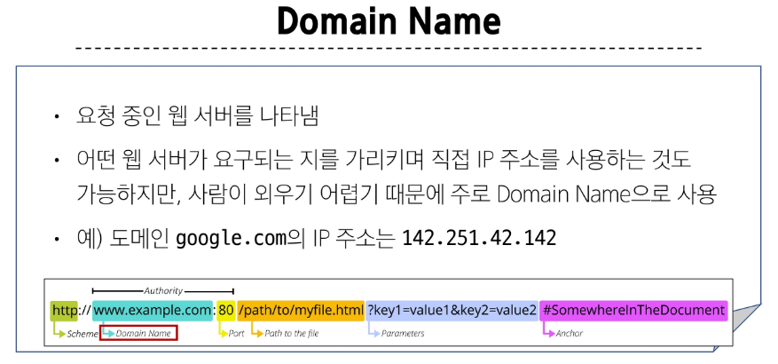
> 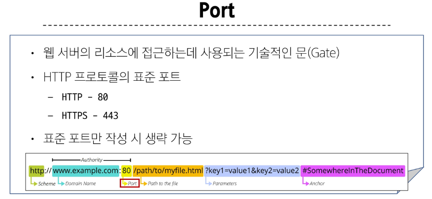
> 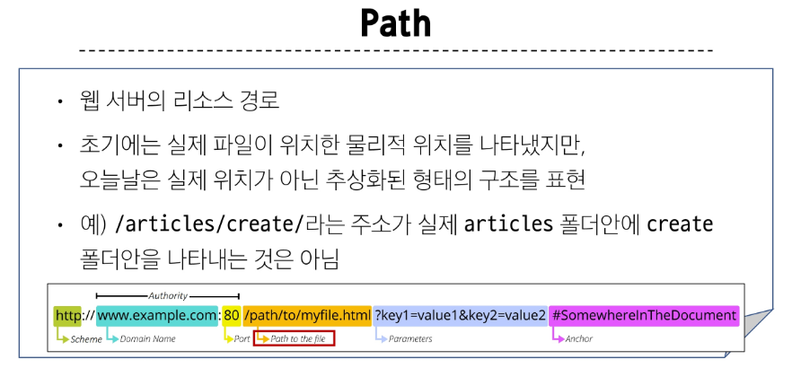
> 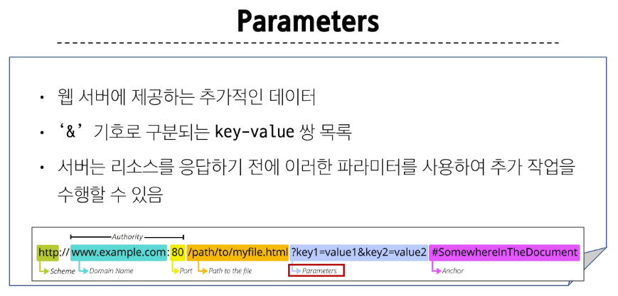
> 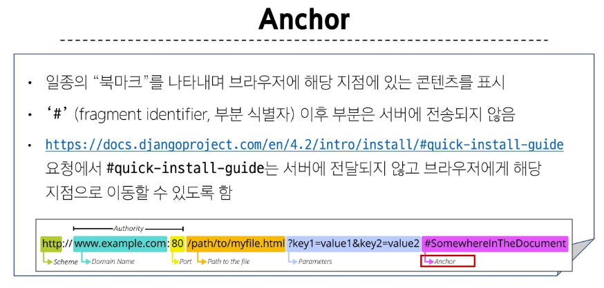

> ### 자원의 행위
> 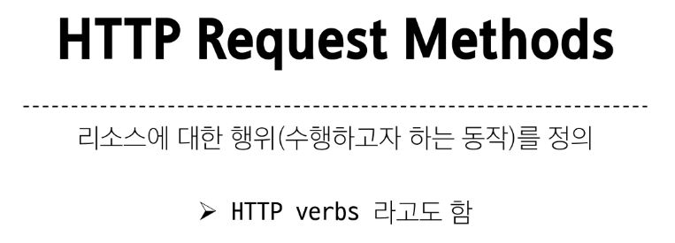
> 
> 
> 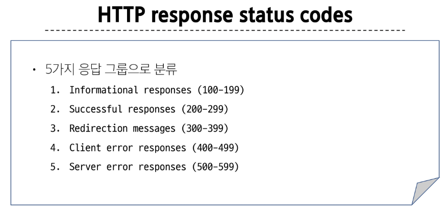

> ### 자원의 표현
> 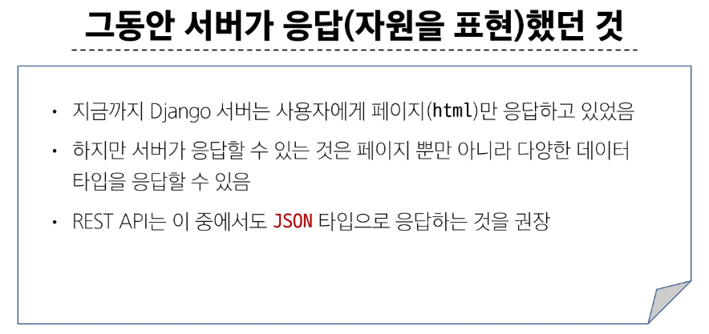
> 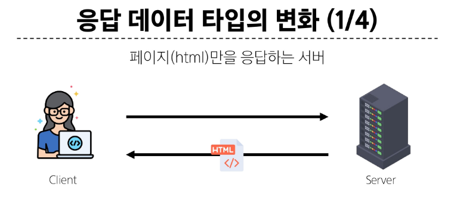
> 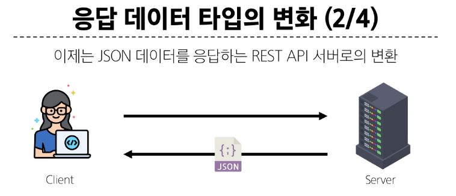
> 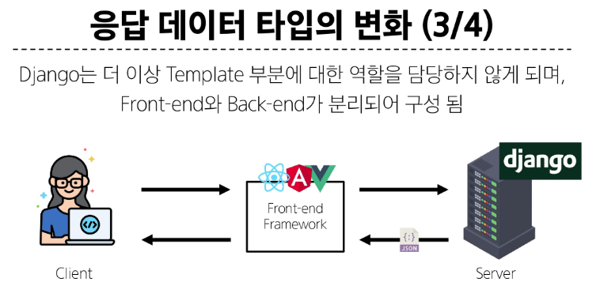
> 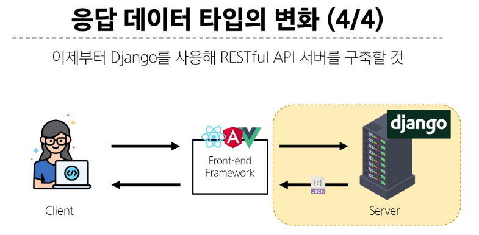

> ### json 데이터 응답
> 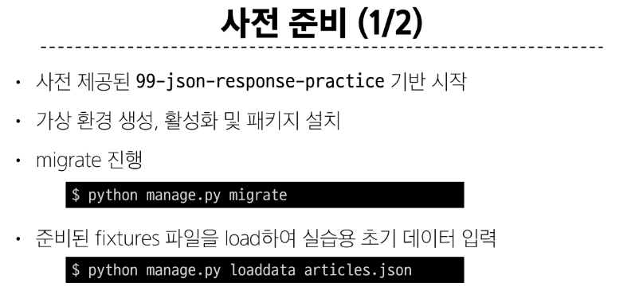
> 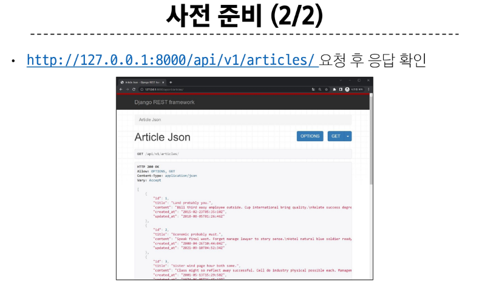
> 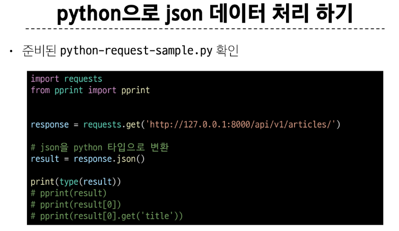