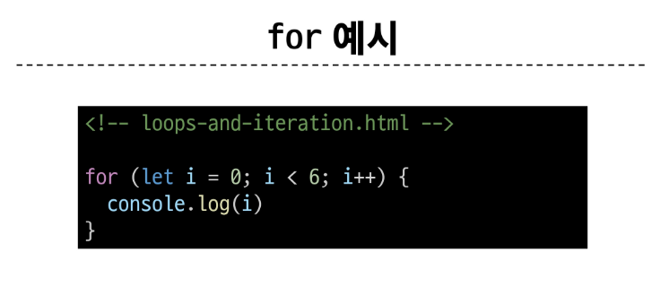

# JAVASCRIPT 02 💻

> ### 데이터 타입
> 
> 

> #### 원시 자료형
> 
>> - Number
>> - String
>> - Null
>> - undefined
>> - Boolean
> 
> 
> 
> 
> 
> 
> 
> 
> 

> #### 참조 자료형
> 

> #### 연산자
> 
> 
> 
> 
> 
> 

> #### 조건문
> 
> 
> 
> 

> #### 반복문
> 
> 
> 
> 
> 
> 
> 
> 
> 
> 
> 
>> - for ...in (객체, 순서 보장 x), for ...of (반복가능한 배열, String, iterable, 순서 보장 o)
> 
> 
> 

> #### NaN
> 
> 
> 