# JAVASCRIPT 03 💻

> ### Function
> 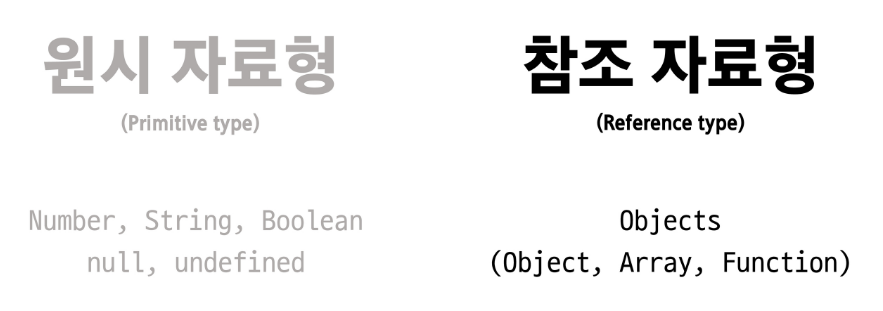
> 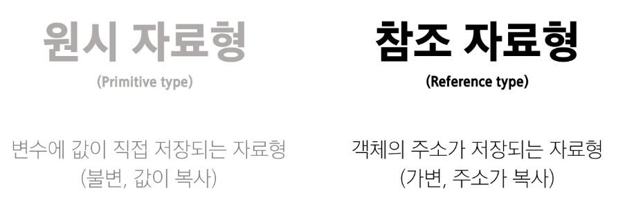
> - 참조 자료형에 속하며 모든 함수는 Function object
> 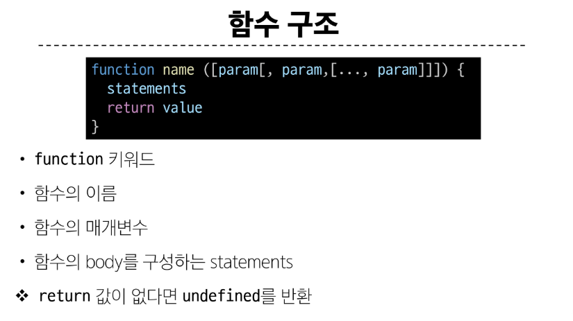

> ### 함수 정의 2가지 방법
> 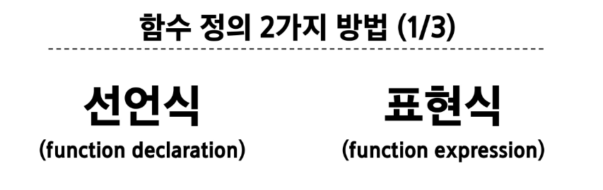
> 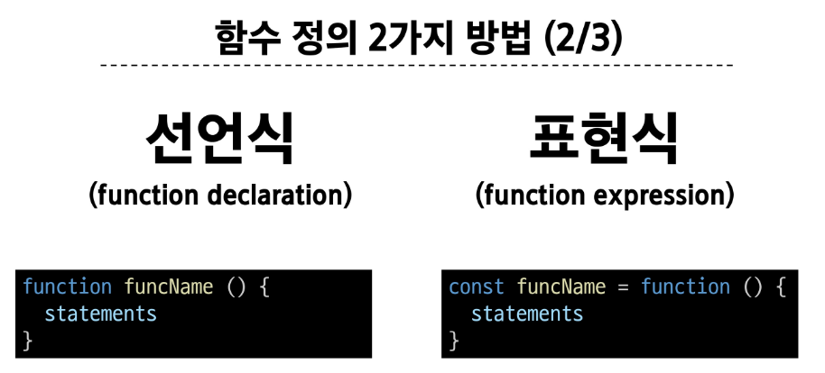
> 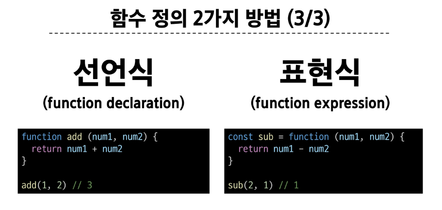

> ### 함수 선언식
> 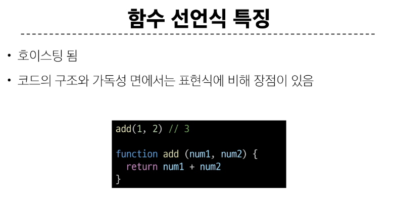

> ### 함수 표현식
> 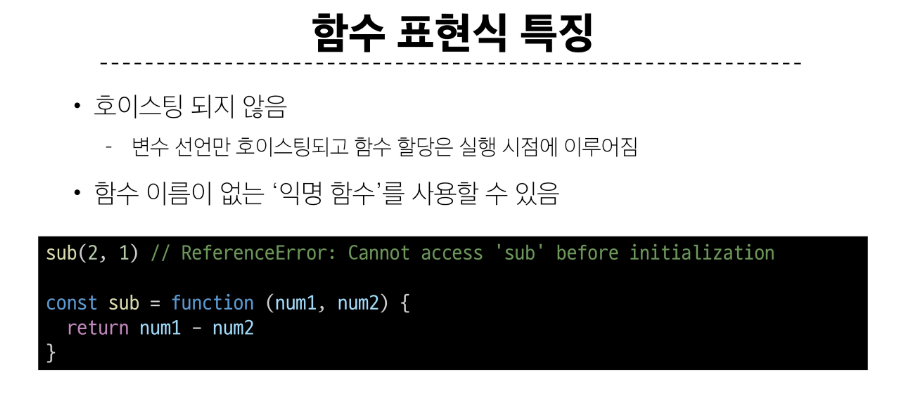
> 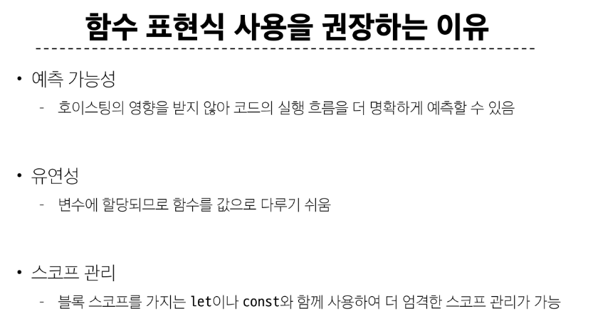

> ### 화살표 함수 표현식
> 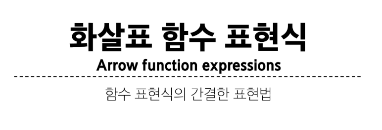
> 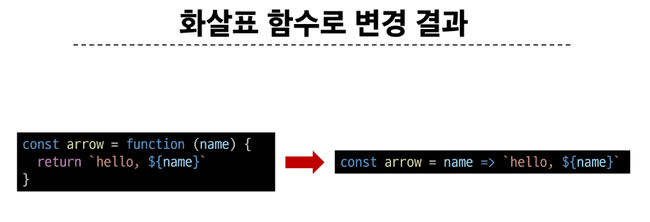
> 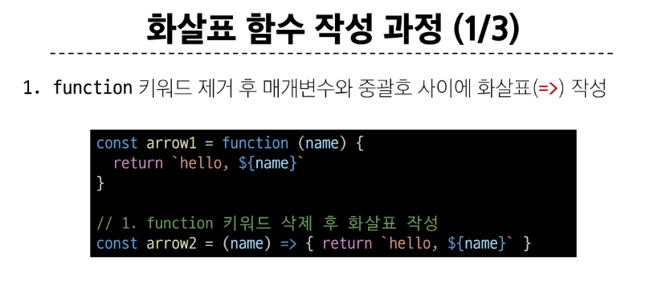
> 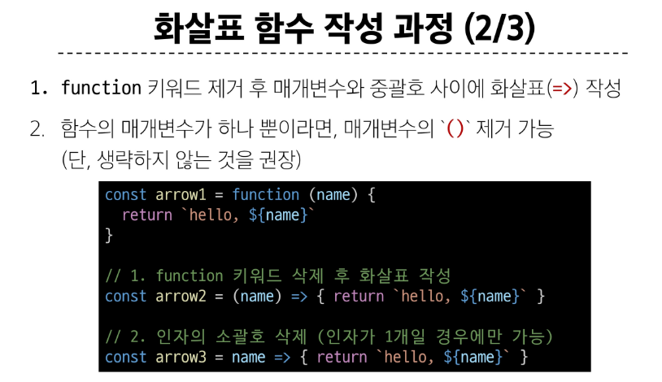
> 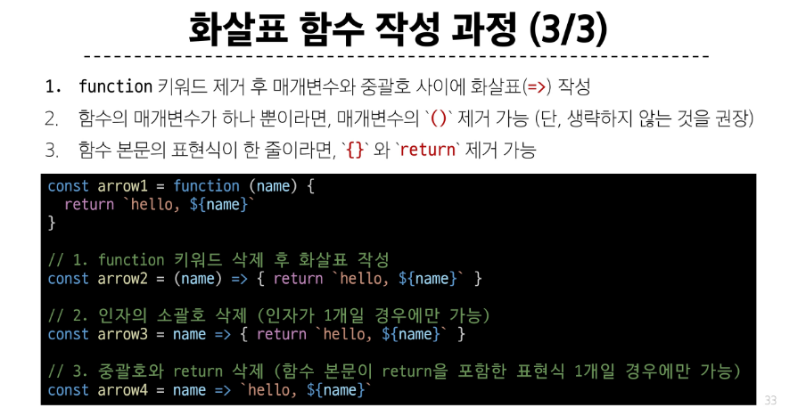
> 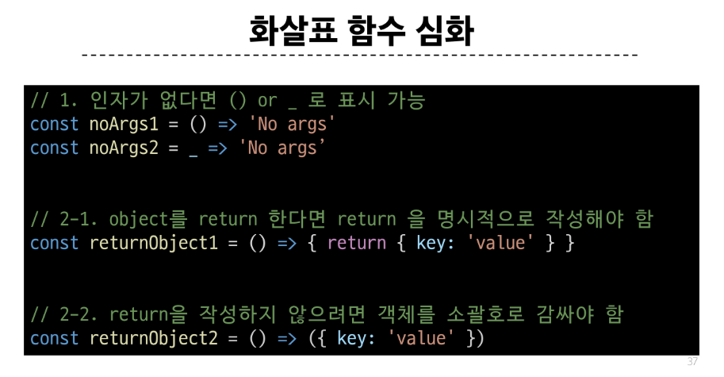

> ### 매개변수
> 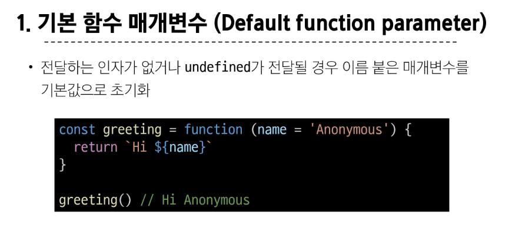
> 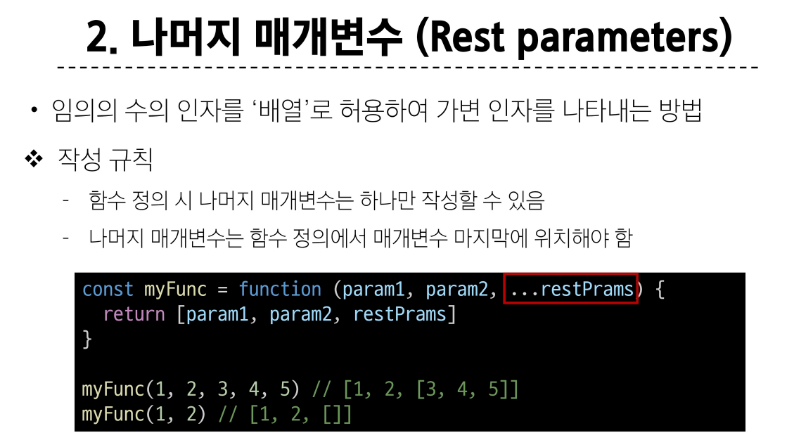
> 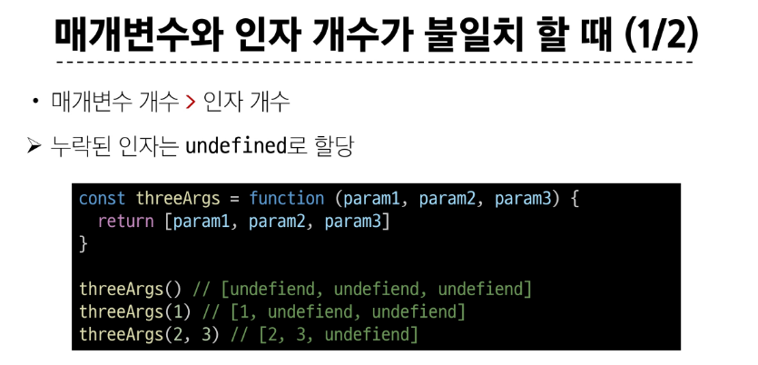
> 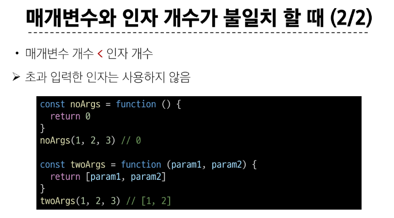

> ### Spread syntax
> 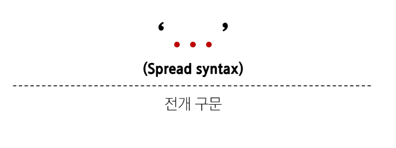
> 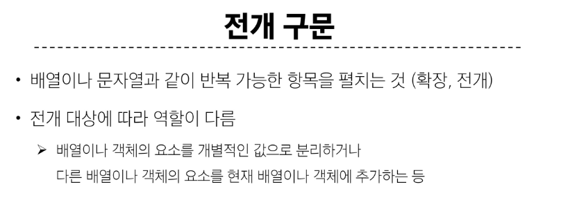
> 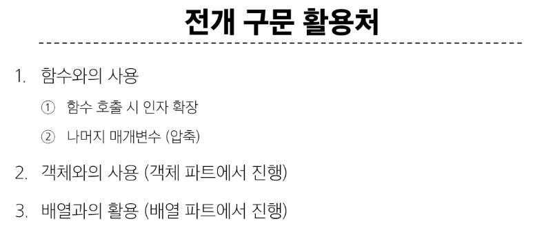
> 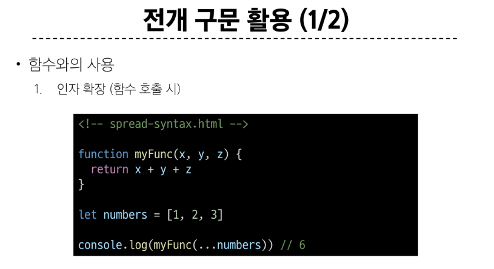
> 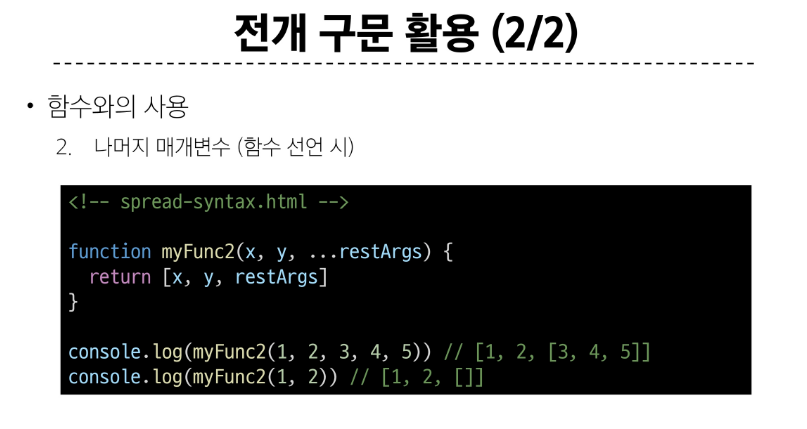

