# JAVASCRIPT 05 💻

> ### Object
> 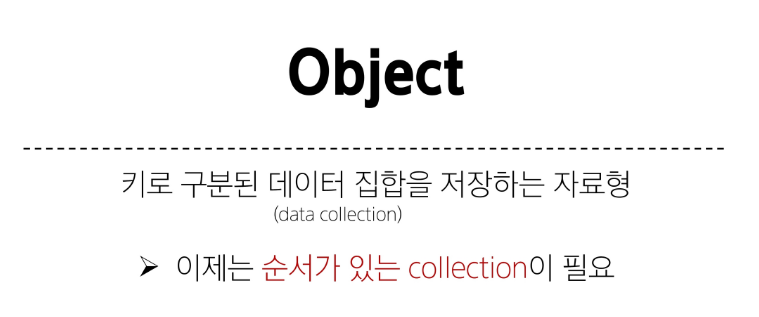
> 
> 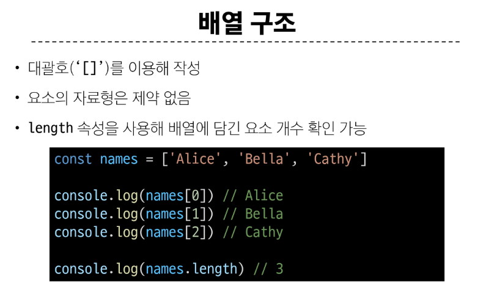
> 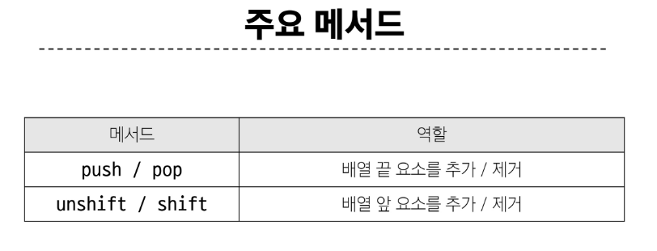
> 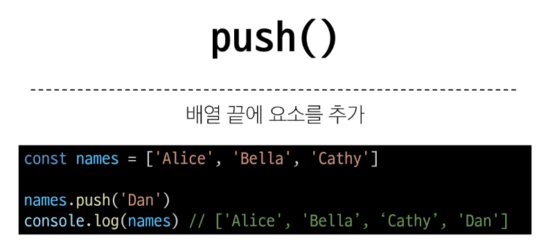
> 
> 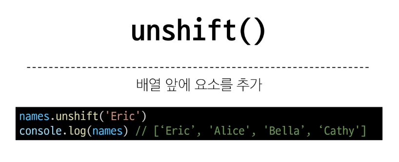
> 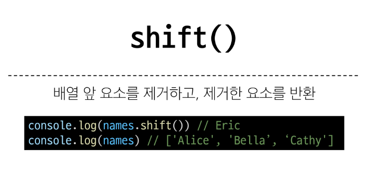

> ### Array Helper Methods
> 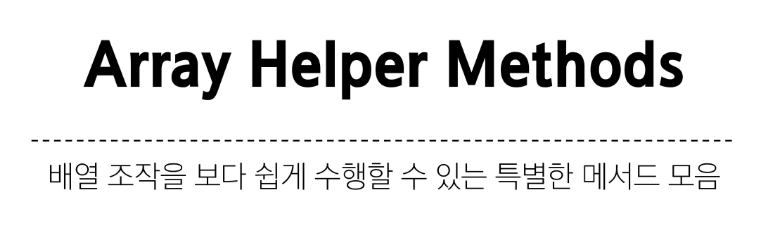
> 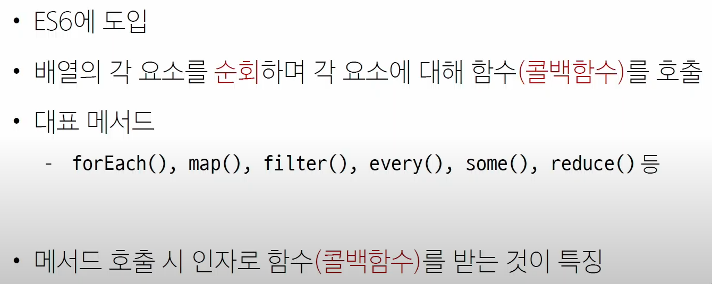

> ### Callback function
> 
> 
> 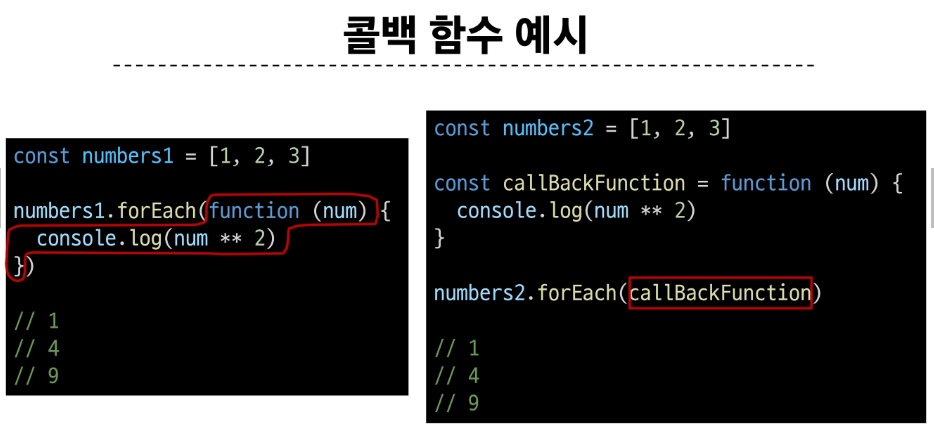
> 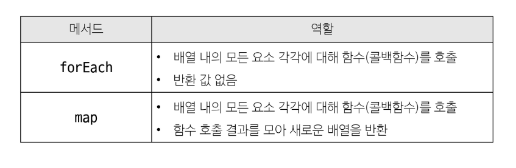

> ### forEach()
> 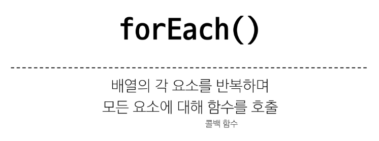
> 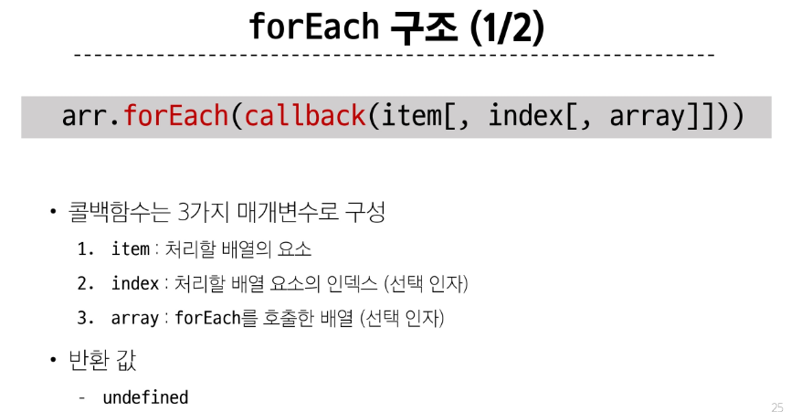
> 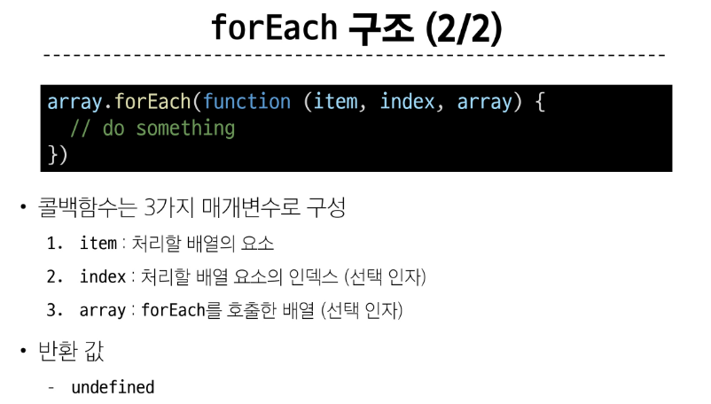
> 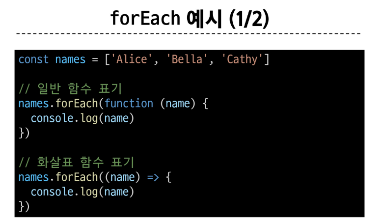
> 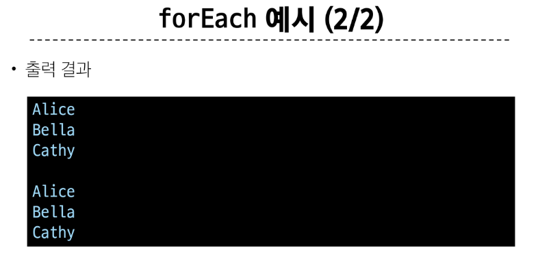
> 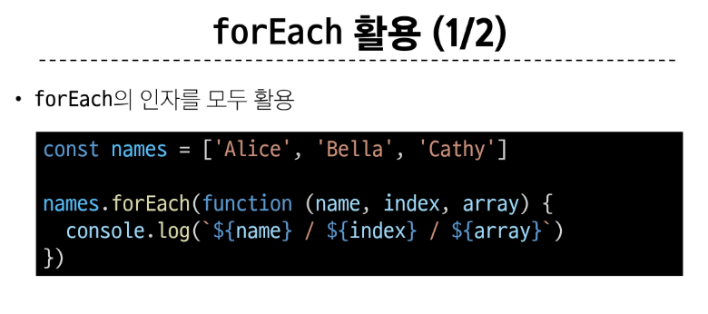
> 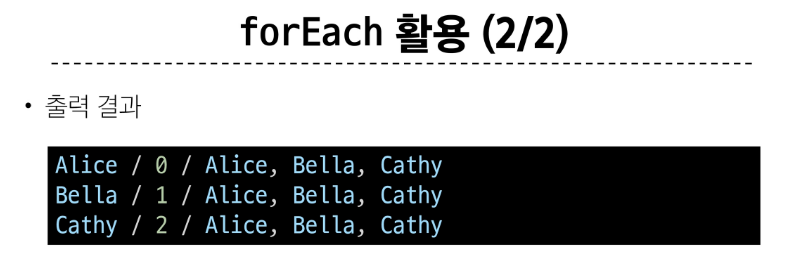

> ### map()
> 
> 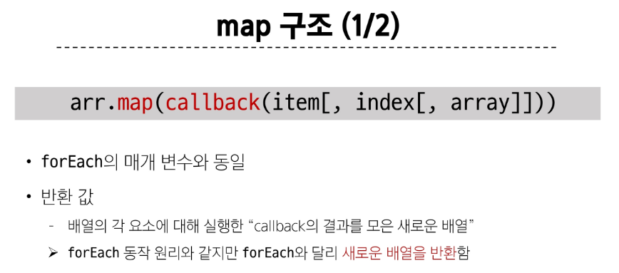
> 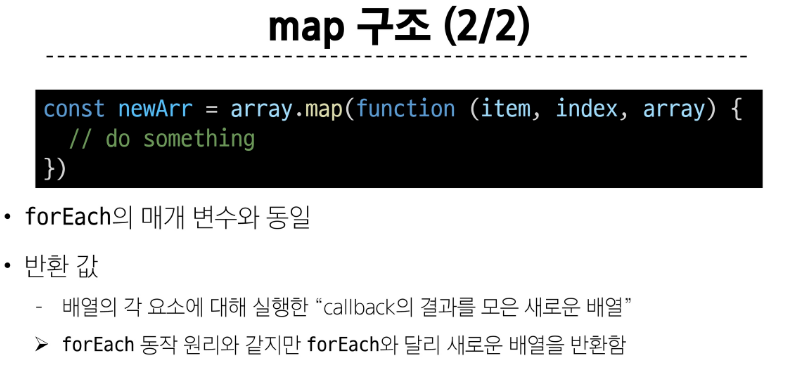
> 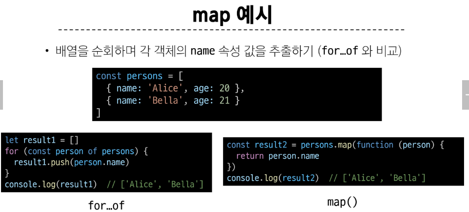
> 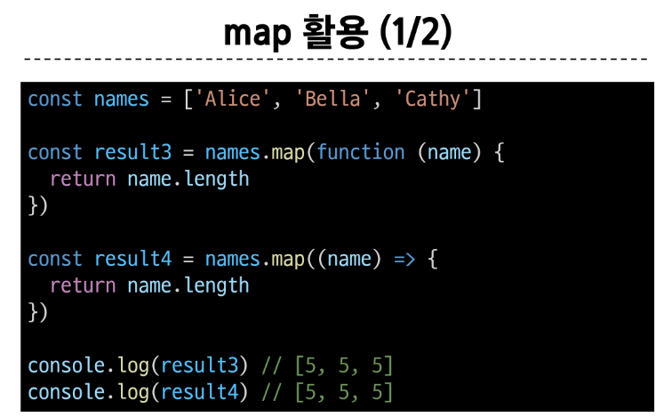
> 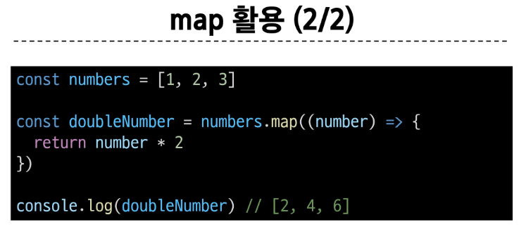
> 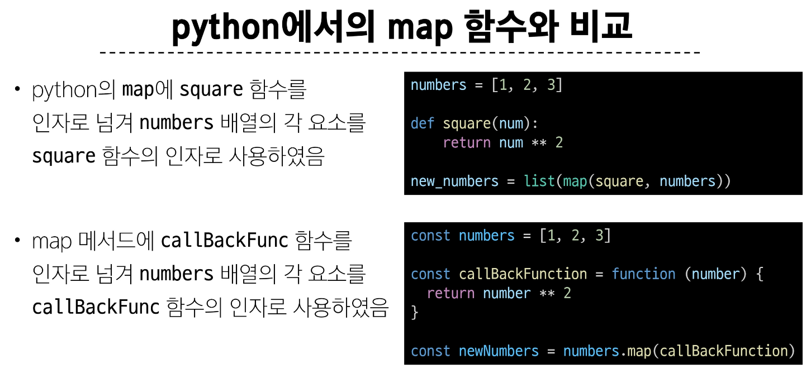

> ### 배열 순회
> 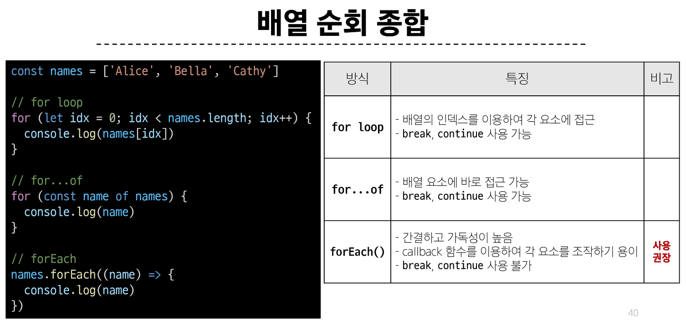
> 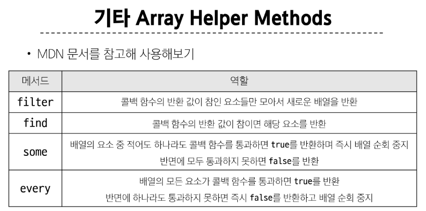

> ### 배열 with '전개 구문'
> 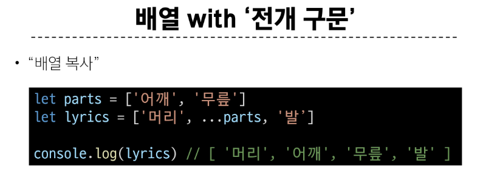

> ### 콜백 함수의 이점
> 1. 함수의 재사용성
>> 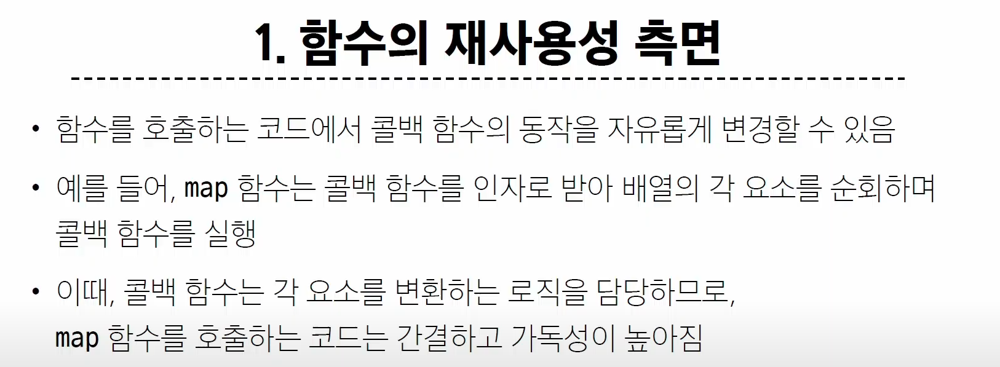
> 2. 비동기적 처리

> 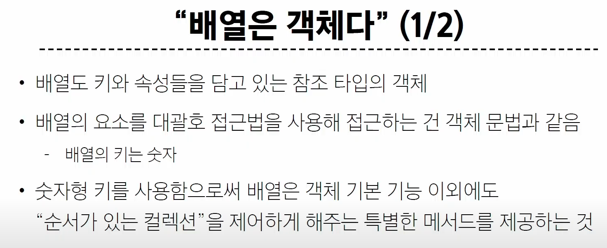
> 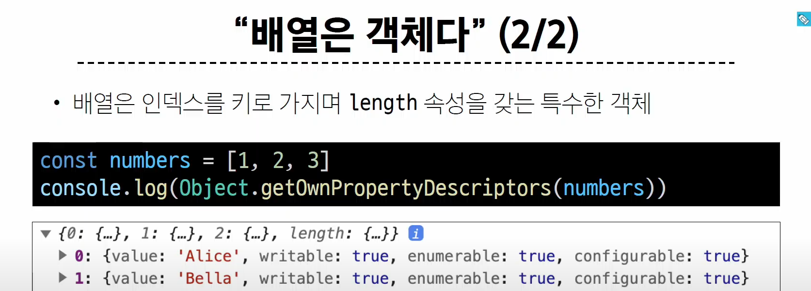
