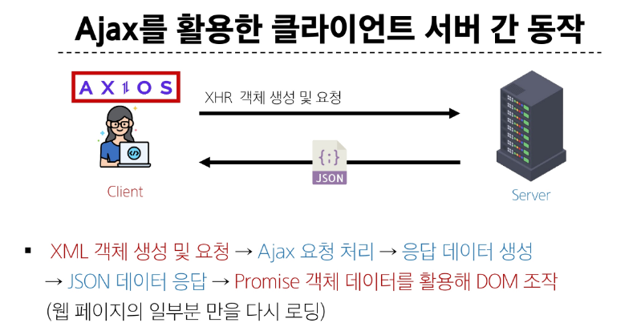
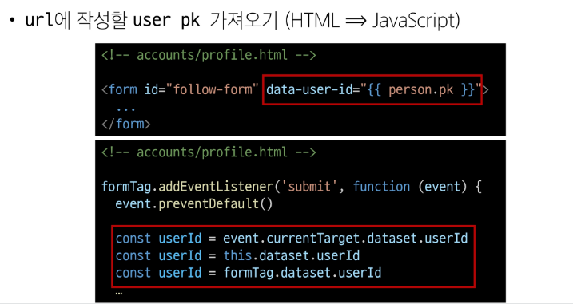
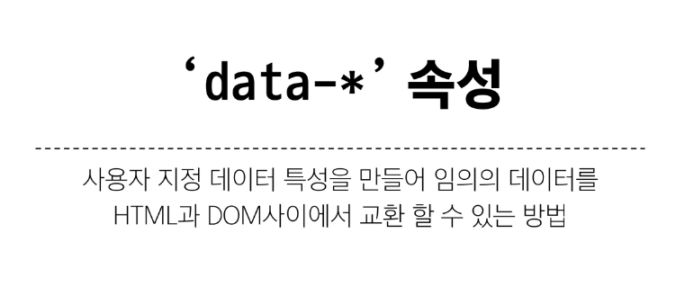
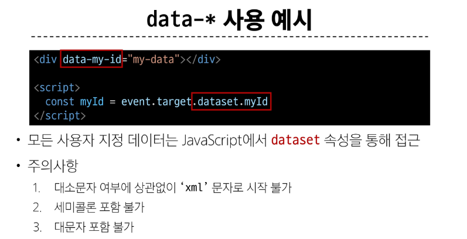
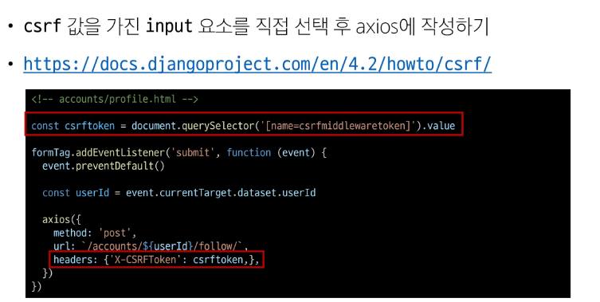
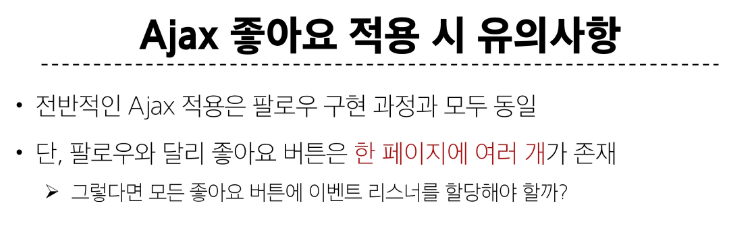
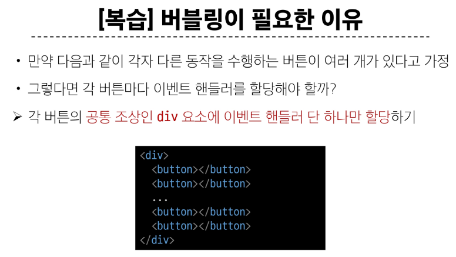

# JAVASCRIPT 08 💻

> ### Ajax
> 

> ### django + axios
> - 기존
>> - HTML form 태그를 사용해 POST 메서드로 데이터를 제출
> - 변경
>> - axios 사용하여 POST 메서드로  데이터를 제출
>> - form의 method, action 속성이 불필요
>> - 팔로우 버튼에 submit 이벤트가 발생하면 django - json 데이터를 응답
>> - JS에서 응답받은 json 데이터를 활용해 팔로우 버튼을 조작(DOM)

> 
> 
> 
> 
> 
> 