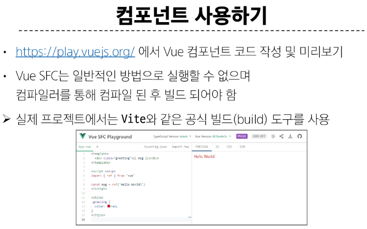
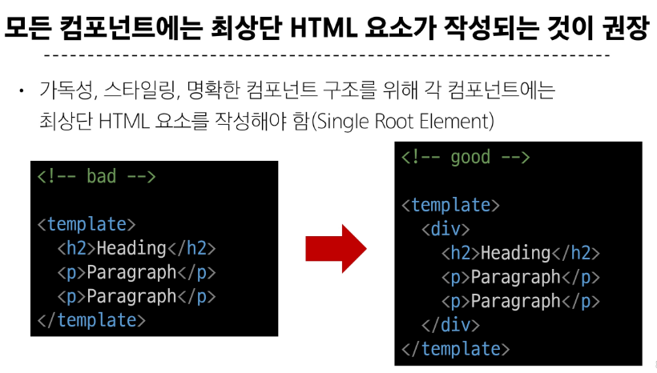

# single-file-components 💨

> ### Component
> 
> 
> 
> 
> 

> ### SFC 구성요소
> 
> 
> 
> 
> 

> ### Vue project 생성
> 
> 
> 
> 
> 
> 
> 

> ### NPM (Node Package Manager)
> 
> 

> ### Module
> 
> 
> 
> 

> ### Bundler
> 
> 

> ### Vue Project 구조
> 
> 
> 
> 
> 
> 
> 
> 
> 
> 
> 

> ### Vue Component 활용
> 
> 
> 
> 
> 
> 
> 

> ### Virtual DOM
> 
> 
> 
> 
> 

> ### Composition API & Option API
> 
> 
> 
> 
> 

> ### Single Root Element
> 

> ### CSS scoped
> 
> 
> 

> ### Scaffolding
> 
> 
> 