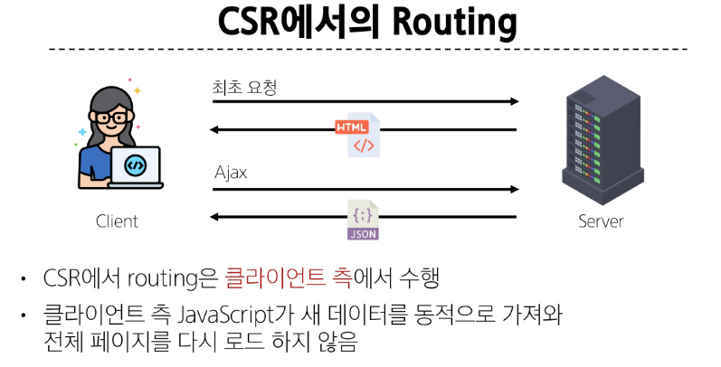
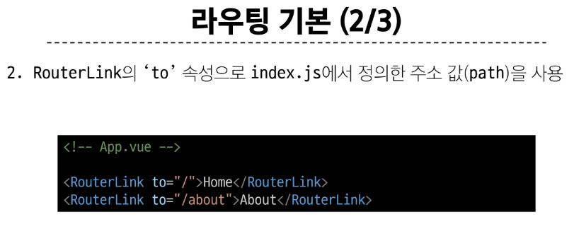
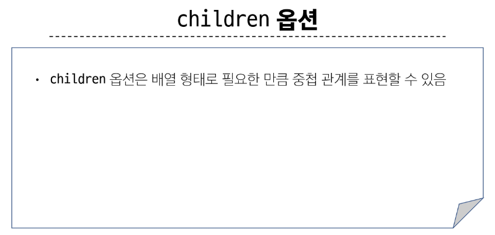
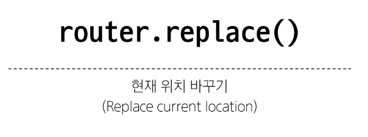
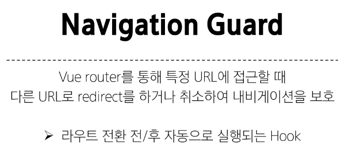
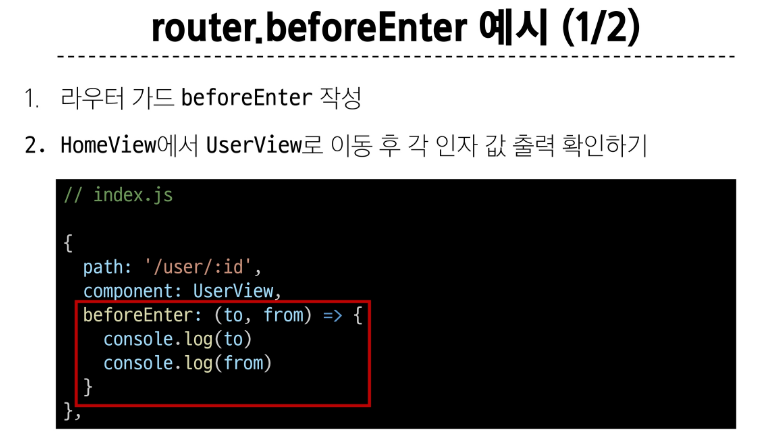
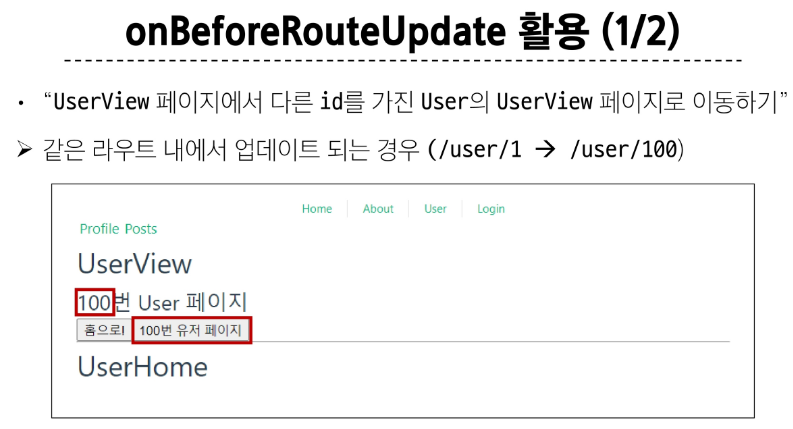

# Routing 💨

> ### Routing
> 
> 
> 
> 

> ### Vue Router
> 
> 
> 
> 
> 

> ### Basic Routing
> 
> 
> 

> ### Named Routes
> 
> 
> 

> ### Dynamic Route Matching
> 
> 
> 
> 
> 
> 
> 

> ### Nested Routes
> 
> 
> 
> 
> 
> 
> 
> 
> 
> 
> 
> 

> ### Programmatic Navigation
> 
> 
> 
> 
> 
> 
> 
> 
> 
> 
> 

> ### Navigation Guard
> 
> 
> 
> 
> 
> 
> 
> 
> 
> 
> 
> 

> ### Pre-route Guard
> 
> 
> 
> 
> 
> 
> 
> 
> 

> ### In-component Guard
> 
> 
> 
> 
> 
> 
> 

> ### Navigation Guard
> 

> ### Lazy Loading Routes
> 